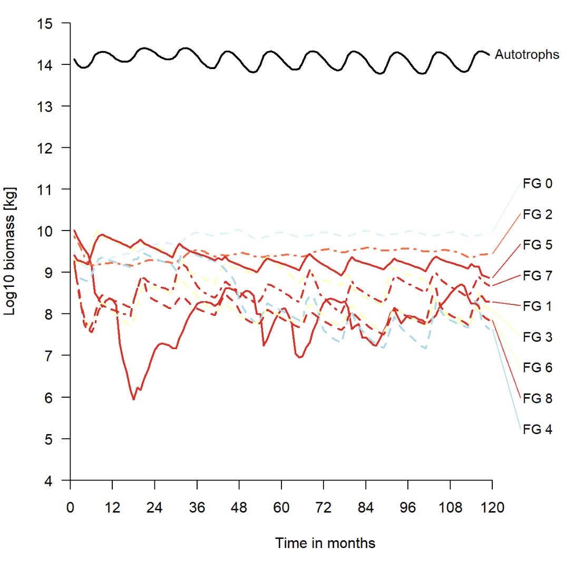

# Norway - default settings

This is just a first look at what the model predicts for Norway with default settings.

This page was last updated ```r Sys.time() ```

```{r setup, include=F}
library(MadingleyR)
library(ggplot2)
library(ggpubr)
library(raster)
library(ggstance)
knitr::opts_chunk$set(comment='%')
load("data/initOut_demo.RData") # mdata - why do I need this

sptl_inp = madingley_inputs("spatial inputs")
chrt_def = madingley_inputs("cohort definition")
stck_def = madingley_inputs("stock definition")
mdl_prms = madingley_inputs("model parameters") # useful later for running the model
```

First we try with 4 x 4 grid cells (16 grid cells, with dispersion) in south-central Norway. Then we try with just one grid cell, but a longer temporal scope.

## 16 grid cells

Lets start with a too big bonding box for illustration.
```{r,  message=FALSE}
spatial_window = c(5, 12, 58, 65)
plot_spatialwindow(spatial_window)
```

The default resolution is 1 degree, giving (7 x 7 =) 49 cells in this case, which is too much for testing purpuses due to compuatation time. The resolution is defined by the spatial input rasters, but 1 degree resolution is the maximum. Finer resolution is possible, ut not courser. I will therefore focus on just Central Norway. Plotting on top of mean annual temperature.

```{r}
mat = mean(sptl_inp[[10]])
```

```{r,  message=FALSE, fig.width=7, fig.width=7}
spatial_window = c(6, 10, 59, 63)
plot_spatialwindow(spatial_window, 
                   ylim=c(55,65), xlim=c(-10,20),
                   input_raster = mat)
```

Notice how at high latitudes, one degree north-south is much longer in distance compared to 1 degree east-west.
Run time: approx 5 sec.
```{r}
mdata <-  madingley_init(spatial_window = spatial_window,
                       cohort_def = chrt_def,
                       stock_def = stck_def,
                       spatial_inputs = sptl_inp,
                       max_cohort = 100)
```


Running the model for 100 years with default setting, exept the max limit og 100 cohorts per grid cell.
```{r, cache=T, eval=F}
mdata2 <-  madingley_run(
  out_dir = "temp",
  madingley_data = mdata, 
  years = 100, 
  cohort_def = chrt_def, 
  stock_def = stck_def, 
  spatial_inputs = sptl_inp, 
  model_parameters = mdl_prms,
  max_cohort = 100,
  silenced = TRUE)

# Runtime approx 15 sec for 10 years and 2 min for 100 years
```
Save the output.
```{r, eval=F}
save(mdata2, chrt_def, mdl_prms, sptl_inp, stck_def, 
        file = "data/NorwayDefaultSpinup.RData")
```

And read back
```{r}
load("data/NorwayDefaultSpinup.RData")
```


```{r, fig.height=3, fig.width=7, message=FALSE, error=FALSE,linewidth=90}
plot_timelines(mdata2)
```

The 100 year spin up was seemingly enough, and we can see the variation stabelising rather quickly. The seasonal patterns are visible for both autotrophs and heterotrophs, but is it big enough? 

Interestingly, when I ran this same code in December 2021, albeit for 10 year only, I got plant biomass that was orders of magnitude higher. The model actually predicted biomass about 50% higher than the total terrestrial biomass on the planet. I [reported this to the developers](https://github.com/MadingleyR/MadingleyR/issues/1), and they have now hopefully fixed it.




Figure: Snapshot of the result from doing a 10 year spin up for the same spatial window, using defoult setting, in December 2021.


Lets look at the pattern in autotrophic biomass without the log transformation
```{r}
temp <- mdata2$time_line_stocks
temp <- temp[temp$Year >90,] # last 10 years of the simulation
ggplot(data = temp,
       aes(x = Month, 
           y = TotalStockBiomass/10^12))+
  geom_line(lwd = 1.5, colour = "grey")+
  geom_point(size = 3 )+
  theme_bw()+
  ylab("Autrophic biomass (megatons)")+
  ylim(c(0,0.25))
```

Actually, this is not unreasonable. Perhaps the biomass even drops too much in winter, seeing how a lot of it should be woody, perennial biomass. Unfortunately I'm not able to extract the biomass for deciduous and coniferous plant separately, except for the last year. This is the mean over the last year I think:

```{r}

temp <- mdata2$stocks

# sum across the 16 grid cells
temp <- aggregate(data = temp,
                  TotalBiomass~FunctionalGroupIndex,
                  FUN = sum)
#rename
temp$FunctionalType <- ifelse(temp$FunctionalGroupIndex==0, "Decidious", "Evergreen")

#plot
ggplot(data = temp,
       aes(x = FunctionalType, 
           y = TotalBiomass/10^12))+
  geom_bar(
    stat = "identity",
    fill = "grey",
    colour = "grey20",
    size=2)+
  theme_bw()+
  ylab("Autrophic biomass (megatons)")
```

This ratio makes sense, and could be tested using landsskogtakseringen. But the numbers are really big! There is a mistake here. Perhaps he page developers didn't update this part of the output? 

There should be almost no biomass in winter for ectothermic, semelparous species (e.g. FG3). 

```{r}
temp <- mdata2$time_line_cohorts

ggplot(data = temp,
       aes(x = Month, 
           y = Biomass_FG_3/10^6),
       group = )+
  geom_line(lwd = 1, colour = "black")+
  theme_bw()+
  ylab("Biomass (tons) for herbivorous,\nectothermic and semelparous species")
```

The model is very unstabel here for a long time, I we cannot really trust the results. But looking a bit closer a the last 10 years:
```{r}
temp <- mdata2$time_line_cohorts
temp <- temp[temp$Year>90,]

ggplot(data = temp[temp$Year>90,],
       aes(x = Month, 
           y = Biomass_FG_3/10^6),
       group = )+
  geom_line(lwd = 1, colour = "black")+
  geom_point(size = 3 )+
  theme_bw()+
  ylab("Biomass (tons) for herbivorous,\nectothermic and semelparous species")
```

Here we actually see the biomass getting quite close to zero in winter, as predicted. I winder if we could ever get some data to validate these numbers for insect biomass.

Bird migration I don't think is accounted for. 

Looking at the log transformed data I thought getting the Madingley model to capture the seasonal change would perhaps be the biggest issue, but these last figures are more promising. 

What are the most dominant functional groups? This is also quite difficult to read from log transformed figures. Lets explore the total biomass in august of the last year.  

```{r}
#First,let make more intuitive names for the functional groups.

link <- data.frame(
  FG = seq(0,8,1),
  FGname = c("Endo. herb.",
             "Endo. carn.",
             "Endo. omni.",
             "Ecto. sem. herb.", # semelparous (insect etc)
             "Ecto. sem. carn.",
             "Ecto. sem. omni.",
             "Ecto. itero. herb.", # iteroparous (reptiles etc)
             "Ecto. itero. carn.",
             "Ecto. itero. omni."
             )
)
```

```{r}
temp <- mdata2$time_line_cohorts
temp <- temp[temp$Month == max(temp$Month)-4,]
data.table::setDT(temp)
tempM <- data.table::melt(temp[,-c(1:2)])
tempM$FG <- link$FGname
tempM$tons <- tempM$value/10^6

ggplot(data = tempM,
       aes(x = FG,
           y = tons))+
  geom_bar(stat = "identity",
           fill = "grey",
           colour = "grey30")+
  coord_flip()+
  theme_bw()
```

What are the endothermic omnivores in Norway. Mice and things? And bears?
The model predicts very little endothermic carnivore biomass, and quite a bit of ectothermic iteroparous carnivore biomass (snakes?!)


We can look at the relationship between individual size (mean per grid cell) and abundance for herbivorous endotherms
```{r, fig.height=3, fig.width=5, message=FALSE,error=FALSE}
temp <- mdata2$cohorts
temp <- temp[temp$FunctionalGroupIndex==0,]

ggplot(data = temp)+
  geom_point(aes(x = log(IndividualBodyMass), 
                 y =  log(CohortAbundance)
                 ),
             alpha=.1, 
             size=8, 
             colour="blue",
             pch=16)+
  theme_bw(base_size = 20)
# plotting all grid cells and all cohorts or FG 0

```

No strong pattern. This is perhaps not very useful, but simply illustrates the two factors that determine the cohort biomass.

Let's explore the cohort data set (`mdata2$cohorts`) a bit more.
```{r}
temp <- mdata2$cohorts
summary(temp)
```

There are 16 cell, and 100 cohorts (row) per cell (because I set 100 as the limit). There are 9 functional groups. Some functional groups have many cohorts per cell.

```{r}
temp <- mdata2$cohorts[mdata2$cohorts$GridcellIndex==0,]
temp <- data.frame(table(temp$FunctionalGroupIndex))

temp2 <- mdata2$cohorts[mdata2$cohorts$GridcellIndex==5,]
temp2 <- data.frame(table(temp2$FunctionalGroupIndex))

names(temp2)[1] <- "FG"
names(temp)[1] <- "FG"

temp2$Freq2 <- temp$Freq[match(temp2$FG, temp$FG)]
data.table::setDT(temp2)
temp3 <- data.table::melt(temp2,
                          id.vars = "FG",
                          variable.name = "grid_cell",
                          value.name = "cohorts")      

temp3$cohorts[is.na(temp3$cohorts)]  <- 0
temp3$cohorts2 <- as.numeric(temp3$cohorts)
temp3$functional_group <- as.numeric(temp3$FG)
temp3$grid_cell <- as.character(temp3$grid_cell)
temp3$grid_cell[temp3$grid_cell == "Freq"] <- "zero"
temp3$grid_cell[temp3$grid_cell == "Freq2"] <- "five"

temp3$names <- link$FGname[match(temp3$FG, link$FG)]
ggplot(data = temp3,
       aes(x = names,
           y = cohorts,
           group = grid_cell,
           fill = grid_cell
           ))+
       geom_bar(stat = "identity",
                position = "dodge",
                colour="black")+
  coord_flip()+
  ylab("Number of cohorts")+
  xlab("")+
  scale_fill_brewer(palette="Spectral")
```

As we can see, endothermic herbivores (e.g. moose) have the most cohorts in these two cells. They also have the biggest biomass besides plants, as we have seen previously. Endothermic carnivores is not very abundant. 

But what separates the endothermic herbivore cohorts?


Lets look some more at differences between the functional groups. A high cohort abundance means you have a high number of similar individuals (e.g. similar in age and size).
```{r, fig.height=4, fig.width=7, message=FALSE,error=FALSE}
temp <- mdata2$cohorts

temp2 <- aggregate(data = temp,
                   IndividualBodyMass~factor(FunctionalGroupIndex),
                   FUN = mean)
temp2$CohortAbundance <- aggregate(data = temp,
                   CohortAbundance~factor(FunctionalGroupIndex),
                   FUN = mean)[,2]

names(temp2)[1]<- "FG"

temp2$FG <- as.character(temp2$FG)
temp2$FGname <- link$FGname[match(temp2$FG, link$FG)]


#ggplot(temp2, aes(x = CohortAbundance,
#                 y = IndividualBodyMass,
#                 label = FGname))+
#  geom_text(size = 5, position =  position_dodge2v(2000))+
#  theme_bw(base_size = 20)+
#  scale_y_continuous(expand = expansion(mult=c(.2,.2)))+
#  scale_x_continuous(expand = expansion(mult=c(.2,.2)))

ggplot(data = temp2,
       aes(x = FGname,
           y = CohortAbundance))+
  geom_bar(stat = "identity",
           fill = "grey",
           colour = "grey30")+
  coord_flip()+
  theme_bw()+
  ylab("Avg. #individuals per cohort")
```

Ectothermic semelparous herbivores (insects) really stick out as being numerous and similar. Note that other functional groups may be more numerous than what this figure shows, because they are split over more cohorts.

```{r}
temp <- mdata2$cohorts

temp2 <- aggregate(data = temp,
                   CohortAbundance~factor(FunctionalGroupIndex),
                   FUN = sum)

names(temp2)[1]<- "FG"
names(temp2)[2]<- "CohortSum"

temp2$FG <- as.character(temp2$FG)
temp2$FGname <- link$FGname[match(temp2$FG, link$FG)]

ggplot(data = temp2,
       aes(x = FGname,
           y = CohortSum))+
  geom_bar(stat = "identity",
           fill = "grey",
           colour = "grey30")+
  coord_flip()+
  theme_bw()+
  ylab("Total number of individuals")
```

The patter is the same for total number of individuals.


Now we can look at the cohort biomass distribution for each of the functional groups using this built in function.
```{r, fig.width=7, fig.height=7}
plot_densities(mdata2)
```

This figure is showing the distribution of total cohort biomass for each FG. For Herbivores (top left), the distribution is left-skewed, telling us that there is a threshold for how big a cohort can get. This can be due to reproductive limitations or perhaps intraspecific competition leading to starvation or dispersal. Ectotherm biomass has a clear optimum, but no limitation in size, probably due to high plasticity in reproductive rates.  


And here, the trophic pyramid:
```{r, message=FALSE,error=FALSE,linewidth=90}
plot_trophicpyramid(mdata2)
```

Se the page on trophic pyramids for a more detailed exploration of this figure and what it contains. 


Create log10-binned food-web plot
```{r, message=FALSE,error=FALSE,linewidth=90}
plot_foodweb(mdata2, max_flows = 5)
```

The interactions are dominated by endothermic omnivores (mice?) eating endothermic herbivores.
I'm not sure if this is interactions summed over one year, or what.

Plot the spatial biomass
```{r, message=FALSE,error=FALSE,linewidth=90}
plot_spatialbiomass(mdata2, functional_filter = TRUE)
```

There are strong spatial patterns. FG1 for example, endothermic carnivores, are just about absent in many grid cells.


The next step I think is to go though the model parameters in mdl_prms and see if the settings make sense for boreal, mainly forested or alpine, ecosystem. We can also change values in the spatial input sptl_inp, for example setting the max biomass for ectotherms (we don't have large reptiles here).


## Single grid cell
Using a single grid cell we can run the simulation for longer, and see how that affects things.

```{r,  message=FALSE, fig.width=7, fig.width=7}
spatial_window = c(9, 10, 60, 61)
plot_spatialwindow(spatial_window, 
                   ylim=c(55,65), xlim=c(-10,20),
                   input_raster = mat)
```

```{r}
mdata <-  madingley_init(spatial_window = spatial_window,
                       cohort_def = chrt_def,
                       stock_def = stck_def,
                       spatial_inputs = sptl_inp,
                       max_cohort = 100)
```
Using 100 years instead of 10
```{r, cache=T}
mdata2 <-  madingley_run(
  out_dir = "temp",
  madingley_data = mdata, 
  years = 100, 
  cohort_def = chrt_def, 
  stock_def = stck_def, 
  spatial_inputs = sptl_inp, 
  model_parameters = mdl_prms,
  max_cohort = 100,
  silenced = TRUE)

# Runtime approx 45 sec
```

```{r, fig.height=7, fig.width=7, message=FALSE,error=FALSE,linewidth=90}
plot_timelines(mdata2)
```

The components seem to stabilise relatively fast, and after ~20 years there are no long-term trends (results vary between each time this page is rendered). The relative biomass distribution between functional groups is different. This is probably a characteristic of this grid cell, and have less to do with the number of years simulated by the model. 


