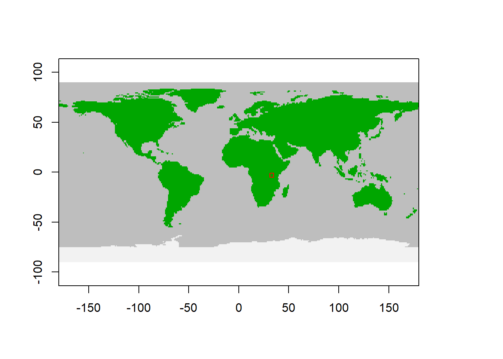

# Step 1 & 2


## Load data

Using defult data to initialise the model


Spatial model domain = c(min_long, max_long, min_lat, max_lat)

```r
spatial_window = c(31, 35, -5, -1)
```

Plot the spatial window to check selection

```r
plot_spatialwindow(spatial_window)
```



## Initialisation

...
