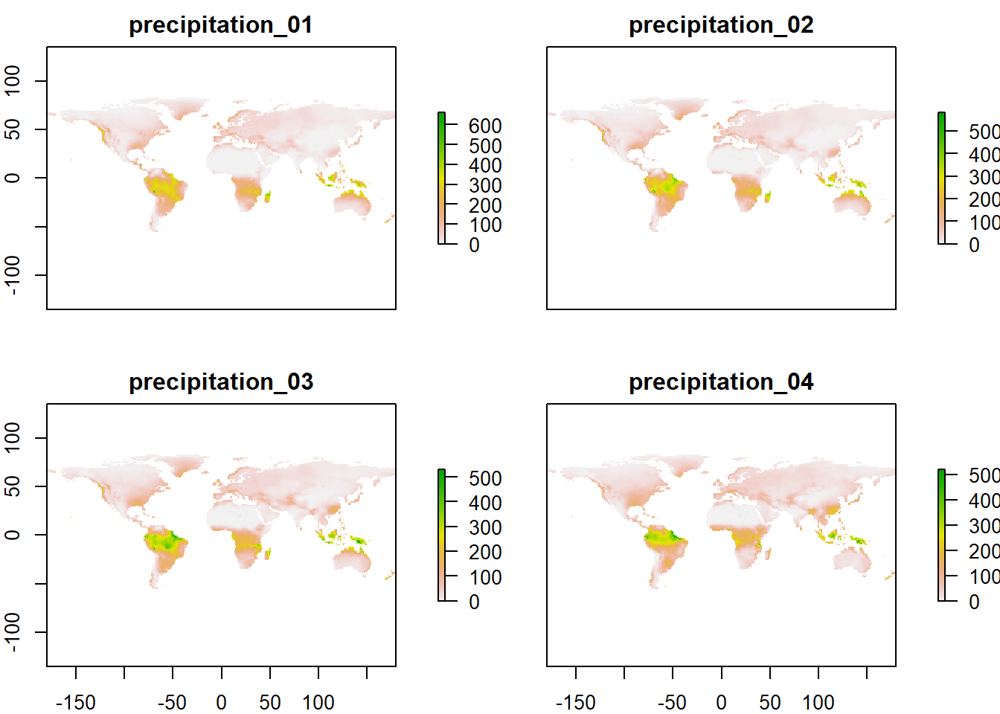

# Step 1 - 3


## Step 1 - Load data

Defining the study area in degree long-lat.

```r
spatial_window = c(31, 35, -5, -1)
```

Plot the spatial window to check selection

```r
plot_spatialwindow(spatial_window)
```


This corresponds to somewhere in the Serengetti I think.

Now I will define the input data - `madingley_inputs()` just contains the default data to initialise the model. All of these can be twaked by the user, which I will do later in the Norwegian example. The spatial inputs is a relatively big list of raster files, but the others are small data frames. 

```r
sptl_inp = madingley_inputs("spatial inputs")
```

```
% Warning: package 'rgdal' was built under R version 4.1.2
```

```r
chrt_def = madingley_inputs("cohort definition")
stck_def = madingley_inputs("stock definition")
mdl_prms = madingley_inputs("model parameters") # useful later for running the model
```


The Spatial Input is the environmental variables in the form of several raster layers. I think the 12 slots are months of a year.

```r
str(sptl_inp,2)
```

```
% List of 13
%  $ realm_classification                :Formal class 'RasterLayer' [package "raster"] with 12 slots
%  $ land_mask                           :Formal class 'RasterLayer' [package "raster"] with 12 slots
%  $ hanpp                               :Formal class 'RasterLayer' [package "raster"] with 12 slots
%  $ available_water_capacity            :Formal class 'RasterLayer' [package "raster"] with 12 slots
%  $ Ecto_max                            :Formal class 'RasterLayer' [package "raster"] with 12 slots
%  $ Endo_C_max                          :Formal class 'RasterLayer' [package "raster"] with 12 slots
%  $ Endo_H_max                          :Formal class 'RasterLayer' [package "raster"] with 12 slots
%  $ Endo_O_max                          :Formal class 'RasterLayer' [package "raster"] with 12 slots
%  $ terrestrial_net_primary_productivity:Formal class 'RasterBrick' [package "raster"] with 12 slots
%  $ near-surface_temperature            :Formal class 'RasterBrick' [package "raster"] with 12 slots
%  $ precipitation                       :Formal class 'RasterBrick' [package "raster"] with 12 slots
%  $ ground_frost_frequency              :Formal class 'RasterBrick' [package "raster"] with 12 slots
%  $ diurnal_temperature_range           :Formal class 'RasterBrick' [package "raster"] with 12 slots
```


```r
temp <- sptl_inp$precipitation
class(temp)
```

```
% [1] "RasterBrick"
% attr(,"package")
% [1] "raster"
```

```r
temp
```

```
% class      : RasterBrick 
% dimensions : 180, 360, 64800, 12  (nrow, ncol, ncell, nlayers)
% resolution : 1, 1  (x, y)
% extent     : -180, 180, -90, 90  (xmin, xmax, ymin, ymax)
% crs        : NA 
% source     : memory
% names      : precipitation_01, precipitation_02, precipitation_03, precipitation_04, precipitation_05, precipitation_06, precipitation_07, precipitation_08, precipitation_09, precipitation_10, precipitation_11, precipitation_12 
% min values :                0,                0,                0,                0,                0,                0,                0,                0,                0,                0,                0,                0 
% max values :         660.1902,         580.5394,         528.9492,         519.1000,         571.3623,         867.7639,         897.7082,         815.6902,         585.4082,         610.5918,         569.8918,         637.4180
```
The resolution is 1 degree, which is approx. 111 km at the equator. 

Plotting precipitation for months jan-april

```r
plot(temp[[1:4]])
```



```r
rm(temp)
```
The data has global coverage. I'm assuming this is WorldClim data, but not sure.


The cohort definitions look like this, and can be modified by the user. 

```r
DT::datatable(chrt_def,
  extensions = "FixedColumns",
  options = list(
    scrollX = TRUE,
    scrollY=T,
    pageLength = 10))
```

```{=html}
<div id="htmlwidget-aae1c49ff249356a1ecb" style="width:100%;height:auto;" class="datatables html-widget"></div>
<script type="application/json" data-for="htmlwidget-aae1c49ff249356a1ecb">{"x":{"filter":"none","vertical":false,"extensions":["FixedColumns"],"data":[["1","2","3","4","5","6","7","8","9"],["Heterotroph","Heterotroph","Heterotroph","Heterotroph","Heterotroph","Heterotroph","Heterotroph","Heterotroph","Heterotroph"],["Herbivore","Carnivore","Omnivore","Herbivore","Carnivore","Omnivore","Herbivore","Carnivore","Omnivore"],["All","All","All","All","All","All","All","All","All"],["Terrestrial","Terrestrial","Terrestrial","Terrestrial","Terrestrial","Terrestrial","Terrestrial","Terrestrial","Terrestrial"],["Mobile","Mobile","Mobile","Mobile","Mobile","Mobile","Mobile","Mobile","Mobile"],["iteroparity","iteroparity","iteroparity","semelparity","semelparity","semelparity","iteroparity","iteroparity","iteroparity"],["Endotherm","Endotherm","Endotherm","Ectotherm","Ectotherm","Ectotherm","Ectotherm","Ectotherm","Ectotherm"],[0.5,0,0.38,0.5,0,0.36,0.5,0,0.36],[0,0.8,0.64,0,0.8,0.64,0,0.8,0.64],[0.5,0.5,0.5,0.5,0.5,0.5,0.5,0.5,0.5],[1,5,5,0.04,0.08,0.04,1,1.5,1.5],[7000000,800000,150000,500,2000,2000,100000,100000,55000],[50,50,50,50,50,50,50,50,50],["None","None","None","None","None","None","None","None","None"]],"container":"<table class=\"display\">\n  <thead>\n    <tr>\n      <th> <\/th>\n      <th>DEFINITION_Heterotroph.Autotroph<\/th>\n      <th>DEFINITION_Nutrition.source<\/th>\n      <th>DEFINITION_Diet<\/th>\n      <th>DEFINITION_Realm<\/th>\n      <th>DEFINITION_Mobility<\/th>\n      <th>DEFINITION_Reproductive.strategy<\/th>\n      <th>DEFINITION_Endo.Ectotherm<\/th>\n      <th>PROPERTY_Herbivory.assimilation<\/th>\n      <th>PROPERTY_Carnivory.assimilation<\/th>\n      <th>PROPERTY_Proportion.suitable.time.active<\/th>\n      <th>PROPERTY_Minimum.mass<\/th>\n      <th>PROPERTY_Maximum.mass<\/th>\n      <th>PROPERTY_Initial.number.of.GridCellCohorts<\/th>\n      <th>NOTES_group.description<\/th>\n    <\/tr>\n  <\/thead>\n<\/table>","options":{"scrollX":true,"scrollY":true,"pageLength":10,"columnDefs":[{"className":"dt-right","targets":[8,9,10,11,12,13]},{"orderable":false,"targets":0}],"order":[],"autoWidth":false,"orderClasses":false}},"evals":[],"jsHooks":[]}</script>
```
The stock definitions are in the default input data limited to evergreen and deciduous plants. 

```r
DT::datatable(stck_def,
  extensions = "FixedColumns",
  options = list(
    scrollX = TRUE,
    scrollY=T,
    pageLength = 10))
```

```{=html}
<div id="htmlwidget-cc8a615ef75a0c3da553" style="width:100%;height:auto;" class="datatables html-widget"></div>
<script type="application/json" data-for="htmlwidget-cc8a615ef75a0c3da553">{"x":{"filter":"none","vertical":false,"extensions":["FixedColumns"],"data":[["2","3"],["Autotroph","Autotroph"],["Photosynthesis","Photosynthesis"],[null,null],["Terrestrial","Terrestrial"],["Sessile","Sessile"],["Deciduous","Evergreen"],[null,null],[null,null],[null,null],[0,0]],"container":"<table class=\"display\">\n  <thead>\n    <tr>\n      <th> <\/th>\n      <th>DEFINITION_Heterotroph.Autotroph<\/th>\n      <th>DEFINITION_Nutrition.source<\/th>\n      <th>DEFINITION_Diet<\/th>\n      <th>DEFINITION_Realm<\/th>\n      <th>DEFINITION_Mobility<\/th>\n      <th>DEFINITION_Leaf.strategy<\/th>\n      <th>PROPERTY_Herbivory.assimilation<\/th>\n      <th>PROPERTY_Carnivory.assimilation<\/th>\n      <th>PROPERTY_Proportion.herbivory<\/th>\n      <th>PROPERTY_Individual.mass<\/th>\n    <\/tr>\n  <\/thead>\n<\/table>","options":{"scrollX":true,"scrollY":true,"pageLength":10,"columnDefs":[{"className":"dt-right","targets":10},{"orderable":false,"targets":0}],"order":[],"autoWidth":false,"orderClasses":false}},"evals":[],"jsHooks":[]}</script>
```
The model parameters are perhaps a bit more cryptic:

```r
DT::datatable(mdl_prms,
  extensions = "FixedColumns",
  options = list(
    scrollX = TRUE,
    scrollY=T,
    pageLength = 20))
```

```{=html}
<div id="htmlwidget-6160ffef4135a3f27299" style="width:100%;height:auto;" class="datatables html-widget"></div>
<script type="application/json" data-for="htmlwidget-6160ffef4135a3f27299">{"x":{"filter":"none","vertical":false,"extensions":["FixedColumns"],"data":[["1","2","3","4","5","6","7","8","9","10","11","12","13","14","15","16","17","18","19","20","21","22","23","24","25","26","27","28","29","30","31","32","33","34","35","36","37","38","39","40","41","42","43","44","45","46","47","48","49","50","51","52","53","54","55","56","57","58","59","60","61","62","63","64","65","66","67","68","69","70","71","72","73","74","75","76","77","78","79","80","81","82","83","84","85"],["Activity_Parameters","Activity_Parameters","Activity_Parameters","Activity_Parameters","Dispersal_Parameters","Dispersal_Parameters","Dispersal_Parameters","Dispersal_Parameters","Dispersal_Parameters","Dispersal_Parameters","EatingCarnivory_Parameters","EatingCarnivory_Parameters","EatingCarnivory_Parameters","EatingCarnivory_Parameters","EatingCarnivory_Parameters","EatingCarnivory_Parameters","EatingCarnivory_Parameters","EatingCarnivory_Parameters","EatingOmnivory_Parameters","EatingHerbivory_Parameters","EatingHerbivory_Parameters","EatingHerbivory_Parameters","EatingHerbivory_Parameters","EatingHerbivory_Parameters","EatingHerbivory_Parameters","EatingHerbivory_Parameters","EatingHerbivory_Parameters","EatingHerbivory_Parameters","MetabolismEctotherm_Parameters","MetabolismEctotherm_Parameters","MetabolismEctotherm_Parameters","MetabolismEctotherm_Parameters","MetabolismEctotherm_Parameters","MetabolismEctotherm_Parameters","MetabolismEctotherm_Parameters","MetabolismEndotherm_Parameters","MetabolismEndotherm_Parameters","MetabolismEndotherm_Parameters","MetabolismEndotherm_Parameters","MetabolismEndotherm_Parameters","MetabolismEndotherm_Parameters","MetabolismHeterotroph_Parameters","MetabolismHeterotroph_Parameters","MetabolismHeterotroph_Parameters","Mortality_Parameters","Mortality_Parameters","Mortality_Parameters","Mortality_Parameters","Mortality_Parameters","Reproduction_Parameters","Reproduction_Parameters","Reproduction_Parameters","Reproduction_Parameters","VegetationModel_Parameters","VegetationModel_Parameters","VegetationModel_Parameters","VegetationModel_Parameters","VegetationModel_Parameters","VegetationModel_Parameters","VegetationModel_Parameters","VegetationModel_Parameters","VegetationModel_Parameters","VegetationModel_Parameters","VegetationModel_Parameters","VegetationModel_Parameters","VegetationModel_Parameters","VegetationModel_Parameters","VegetationModel_Parameters","VegetationModel_Parameters","VegetationModel_Parameters","VegetationModel_Parameters","VegetationModel_Parameters","VegetationModel_Parameters","VegetationModel_Parameters","VegetationModel_Parameters","VegetationModel_Parameters","VegetationModel_Parameters","VegetationModel_Parameters","VegetationModel_Parameters","VegetationModel_Parameters","VegetationModel_Parameters","VegetationModel_Parameters","VegetationModel_Parameters","VegetationModel_Parameters","VegetationModel_Parameters"],[6.61,1.6,1.51,1.53,0.0278,0.48,50000,0.0278,0.48,0.8,0.5,0.7,0.5,0.7,1,6e-06,1,0.7,0.1,0.7,0.7,0.7,0.7,1,1e-11,1,2.1,0.1,0.88,148984000000,0.69,8.617e-05,41918272883,0.69,0.036697248,0.7,908090839730,0.69,8.617e-05,0.0366972,37,0.71,0.69,8.617e-05,0.001,0.003,0.6,0.05,1,1.5,0.25,0.05,0.5,0.961644704,0.237468183,0.100597089,0.001184101,7.154615416,1.270782192,-1.828591558,0.844864063,0.040273936,1.013070062,0.020575964,-1.195235464,0.04309283,-1.478393163,0.139462774,-4.395910091,0.362742634,0.388125108,19.98393943,1.148698636,8.419032427,0.01,24,0.01,24,0.01,12,1,0.001,2,2.26032940698105e-06,0.476],["Activity","Activity","Activity","Activity","Diffusive Dispersal","Diffusive Dispersal","Responsive Dispersal","Responsive Dispersal","Responsive Dispersal","Responsive Dispersal","Eating Carnivory","Eating Carnivory","Eating Carnivory","Eating Carnivory","Eating Carnivory","Eating Carnivory","Eating Carnivory","Eating Carnivory","Eating Omnivory","Eating Herbivory","Eating Herbivory","Eating Herbivory","Eating Herbivory","Eating Herbivory","Eating Herbivory","Eating Herbivory","Eating Herbivory","Eating Herbivory","Metabolism Ectotherm","Metabolism Ectotherm","Metabolism Ectotherm","Metabolism Ectotherm","Metabolism Ectotherm","Metabolism Ectotherm","Metabolism Ectotherm","Metabolism Endotherm","Metabolism Endotherm","Metabolism Endotherm","Metabolism Endotherm","Metabolism Endotherm","Metabolism Endotherm","Metabolism Heterotroph","Metabolism Heterotroph","Metabolism Heterotroph","Mortality","Mortality","Mortality","Mortality","Mortality","Reproduction","Reproduction","Reproduction","Reproduction","Terrestrial Carbon","Terrestrial Carbon","Terrestrial Carbon","Terrestrial Carbon","Terrestrial Carbon","Terrestrial Carbon","Terrestrial Carbon","Terrestrial Carbon","Terrestrial Carbon","Terrestrial Carbon","Terrestrial Carbon","Terrestrial Carbon","Terrestrial Carbon","Terrestrial Carbon","Terrestrial Carbon","Terrestrial Carbon","Terrestrial Carbon","Terrestrial Carbon","Terrestrial Carbon","Terrestrial Carbon","Terrestrial Carbon","Terrestrial Carbon","Terrestrial Carbon","Terrestrial Carbon","Terrestrial Carbon","Terrestrial Carbon","Terrestrial Carbon","Terrestrial Carbon","Terrestrial Carbon","Terrestrial Carbon","Terrestrial Carbon","Terrestrial Carbon"],["Terrestrial Warming Tolerance Intercept","Terrestrial Warming Tolerance Slope","Terrestrial TSM Intercept","Terrestrial TSM Slope","Speed Body Mass Scalar","Speed Body Mass Exponent","Density Threshold Scaling","Speed Body Mass Scalar","Speed Body Mass Exponent","Starvation Dispersal Body Mass Threshold","Handling Time Scalar Terrestrial","Handling Time Exponent Terrestrial","Handling Time Scalar Marine (not applicable to current version)","Handling Time Exponent Marine (not applicable to current version)","Referenc eMass","Kill Rate Constant","Kill Rate Constant Mass Exponent","Feeding Preference Standard Deviation","Max Allowed Prey Ratio Omnivores","Handling Time Scalar Terrestrial","Handling Time Scalar Marine (not applicable to current version)","Handling Time Exponent Terrestrial","Handling Time Exponent Marine (not applicable to current version)","Reference Mass","Herbivory Rate Constant","Herbivory Rate Mass Exponent","Attack Rate Exponent Terrestrial","Fraction Edible Stock Mass","Metabolism Mass Exponent","Normalization Constant","Activation Energy","Boltzmann Constant","Normalization Constant BMR","Basal Metabolism Mass Exponent","Energy Scalar","Metabolism Mass Exponent","Normalization Constant","Activation Energy","Boltzmann Constant","Energy Scalar","Endotherm Body Temperature","Metabolism Mass Exponent","Activation Energy","Boltzmann Constant","Background mortailty Rate","Senescence mortality Rate","Starvation logistic Inflection Point","Starvation logistic Scaling Parameter","Starvation maximum Starvation Rate","Mass ratio Threshold","Mass evolution Probability Threshold","Mass evolution Standard Deviation","Semelparity adult Mass Allocation","Calculate Miami NPP, Max NPP","Calculate Miami NPP, T1NPP","Calculate Miami NPP, T2NPP","Calculate Miami NPP, PNPP","Fraction Structure Scalar","Calculate Fraction Evergreen A","Calculate Fraction Evergreen B","Calculate Fraction Evergreen C","Evergreen Annual Leaf Mortality Slope ","Evergreen Annual Leaf Mortality Intercept","Deciduous Annual Leaf Mortality Slope","Deciduous Annual Leaf Mortality Intercept","Fine Root Mortality Rate Slope","Fine Root Mortality Rate Intercept","Structural Mortality P2","Structural Mortality P1","Leaf Carbon Fixation, MaxFracStruct","Half Saturation Fire Mortality Rate","Scalar Fire Mortality Rate","NPP Half Saturation Fire Mortality Rate","NPP Scalar Fire Mortality Rate","Min Evergreen Annual Leaf Mortality","Max Evergreen Annual Leaf Mortality","Min Deciduous Annual Leaf Mortality","Max Deciduous Annual Leaf Mortality","Min Fine Root Mortality Rate","Max Fine Root Mortality Rate","Max Structural Mortality","Min Structural Mortality","Base Scalar Fire","Min Return Interval","Mass Carbon Per Mass Leaf Dry Matter"]],"container":"<table class=\"display\">\n  <thead>\n    <tr>\n      <th> <\/th>\n      <th>params<\/th>\n      <th>values<\/th>\n      <th>category<\/th>\n      <th>notes<\/th>\n    <\/tr>\n  <\/thead>\n<\/table>","options":{"scrollX":true,"scrollY":true,"pageLength":20,"columnDefs":[{"className":"dt-right","targets":2},{"orderable":false,"targets":0}],"order":[],"autoWidth":false,"orderClasses":false,"lengthMenu":[10,20,25,50,100]}},"evals":[],"jsHooks":[]}</script>
```
They are divided into 12 categories:

```r
cat(unique(mdl_prms$category), sep="\n")
```

```
% Activity
% Diffusive Dispersal
% Responsive Dispersal
% Eating Carnivory
% Eating Omnivory
% Eating Herbivory
% Metabolism Ectotherm
% Metabolism Endotherm
% Metabolism Heterotroph
% Mortality
% Reproduction
% Terrestrial Carbon
```
## Step 2 - Modify input parameters
We will not do any modifications at this stage

## Step 3 - Initialisation

Model initialisation is done using ```madingley_init()``` by supplying the input data above (excl. model parameters). Also one can set the maximum number of cohorts allowed per cell. The default is 500 and max is 1000. a higher number increases computation time due to more cohort interactions. 


```r
mdata <-  madingley_init(spatial_window = spatial_window,
                       cohort_def = chrt_def,
                       stock_def = stck_def,
                       spatial_inputs = sptl_inp,
                       max_cohort = 100)
```

```
% Processing: realm_classification, land_mask, hanpp, available_water_capacity
% Processing: Ecto_max, Endo_C_max, Endo_H_max, Endo_O_max
% Processing: terrestrial_net_primary_productivity_1-12
% Processing: near-surface_temperature_1-12
% Processing: precipitation_1-12
% Processing: ground_frost_frequency_1-12
% Processing: diurnal_temperature_range_1-12
% 
```
Run time is just a few seconds.


```r
str(mdata, 1)
```

```
% List of 6
%  $ cohorts       :'data.frame':	1584 obs. of  16 variables:
%  $ stocks        :'data.frame':	32 obs. of  3 variables:
%  $ cohort_def    :'data.frame':	9 obs. of  14 variables:
%  $ stock_def     :'data.frame':	2 obs. of  10 variables:
%  $ spatial_window: num [1:4] 31 35 -5 -1
%  $ grid_size     : num 1
```

The output contain the cohorts and stocks for each pixel.


```r
save(mdata, chrt_def, mdl_prms, sptl_inp, stck_def, 
        file = "data/initOut_demo.RData")
```


