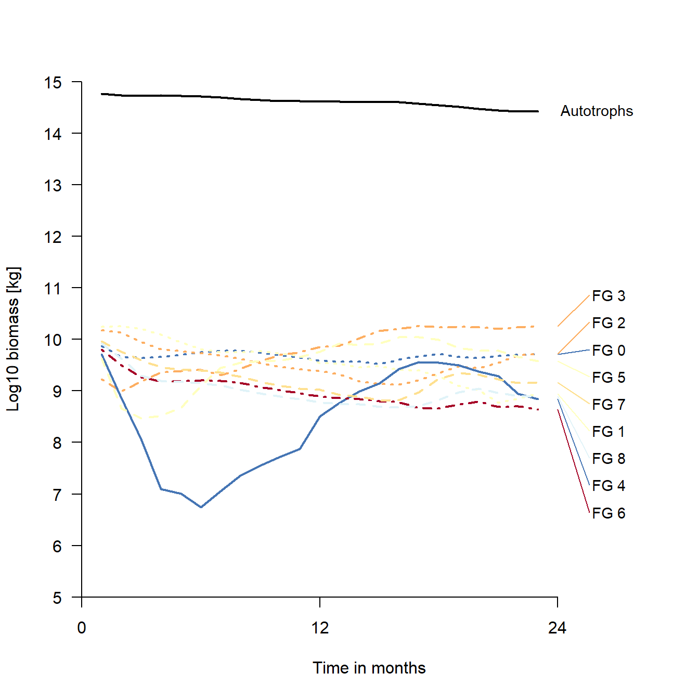
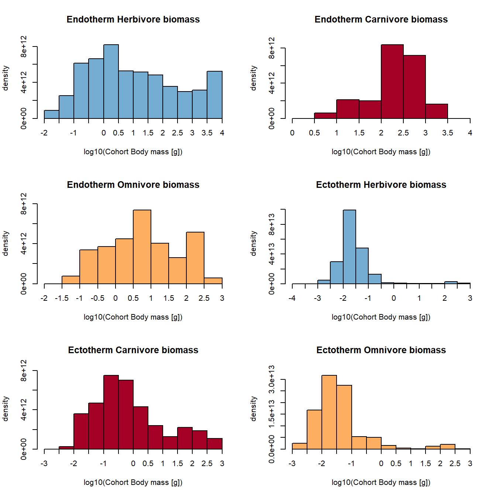
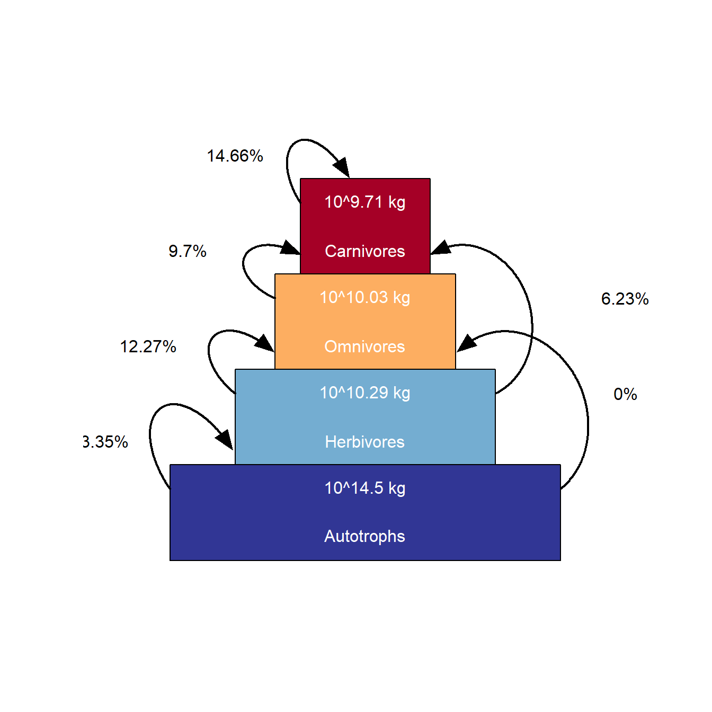
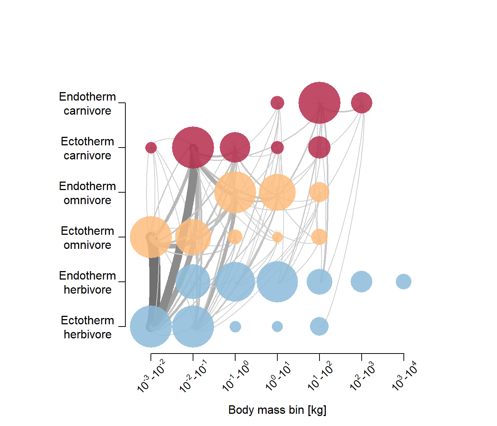
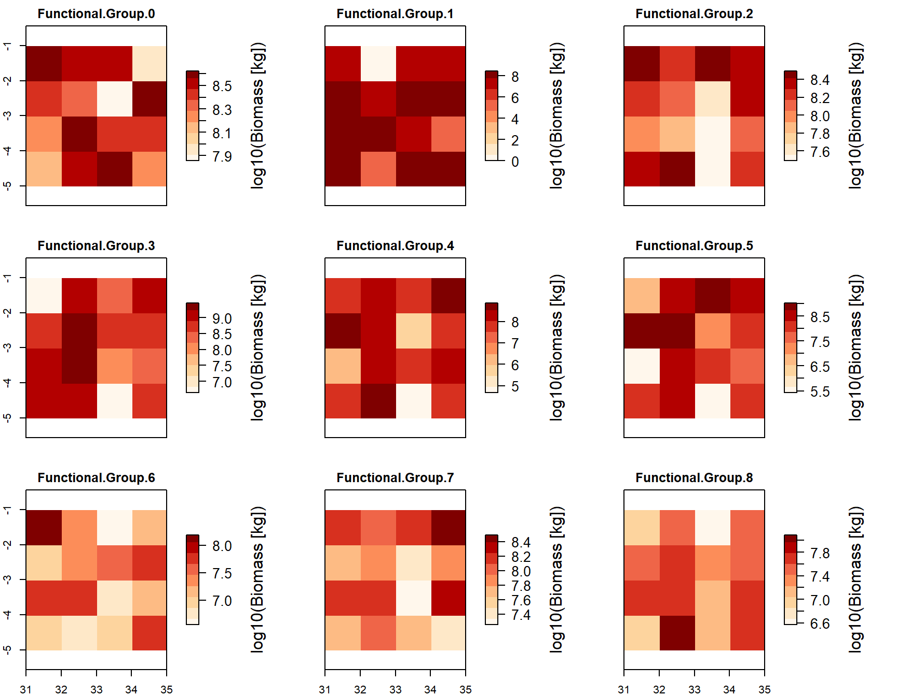

# Step 4 - Spin-up and demonstrating plotting functions


```r
library(MadingleyR)
knitr::opts_chunk$set(comment='%')
load("data/initOut_demo.RData")
```

The spin-up usualy requires a 100-1000 year simulation for the ecosystem parameters to stabilise. Here we will use just 2 years for demonstration. The function takes as input the output data fram ```madingley_init()``` as well as the standard model input variables /(which can be modified). 

The below code is the same as in the vignette example except I had to define my own output folder for some reason. 

```r
mdata2 <-  madingley_run(
  out_dir = "temp",
  madingley_data = mdata, 
  years = 2, 
  cohort_def = chrt_def, 
  stock_def = stck_def, 
  spatial_inputs = sptl_inp, 
  model_parameters = mdl_prms,
  max_cohort = 100)
```

```
% Processing: realm_classification, land_mask, hanpp, available_water_capacity
% Processing: Ecto_max, Endo_C_max, Endo_H_max, Endo_O_max
% Processing: terrestrial_net_primary_productivity_1-12
% Processing: near-surface_temperature_1-12
% Processing: precipitation_1-12
% Processing: ground_frost_frequency_1-12
% Processing: diurnal_temperature_range_1-12
```

```r
# Runtime approx 30 sec

# View the contents of mdata2
str(mdata2,1)
```

```
% List of 10
%  $ cohorts          :'data.frame':	1581 obs. of  16 variables:
%  $ stocks           :'data.frame':	32 obs. of  3 variables:
%  $ cohort_def       :'data.frame':	9 obs. of  14 variables:
%  $ stock_def        :'data.frame':	2 obs. of  10 variables:
%  $ time_line_cohorts:'data.frame':	23 obs. of  11 variables:
%  $ time_line_stocks :'data.frame':	23 obs. of  3 variables:
%  $ out_dir_name     : chr "/madingley_outs_16_12_21_15_38_33/"
%  $ spatial_window   : num [1:4] 31 35 -5 -1
%  $ out_path         : chr "temp"
%  $ grid_size        : num 1
```

This output is similar to the previous outpur from madingley_init() only it also contains stocks and cohorts as timeslines. 

Lets view these timelines.

```r
plot_timelines(mdata2)
```

```
% Warning in xtfrm.data.frame(x): cannot xtfrm data frames

% Warning in xtfrm.data.frame(x): cannot xtfrm data frames
```


Plot body mass density

```r
plot_densities(mdata2)
```

```
% loading inputs from: temp/madingley_outs_16_12_21_15_38_33/
```



Plot trophic pyramid

```r
plot_trophicpyramid(mdata2)
```

```
% loading inputs from: temp/madingley_outs_16_12_21_15_38_33/
```



Create log10-binned food-web plot

```r
plot_foodweb(mdata2, max_flows = 5)
```

```
% loading inputs from: temp/madingley_outs_16_12_21_15_38_33/
```



Plot the spatial biomass

```r
plot_spatialbiomass(mdata2, functional_filter = TRUE)
```

```
% loading inputs from: temp/madingley_outs_16_12_21_15_38_33/
```




```r
save(mdata2, chrt_def, mdl_prms, sptl_inp, stck_def, 
        file = "data/spinupOut_demo.RData")
```


