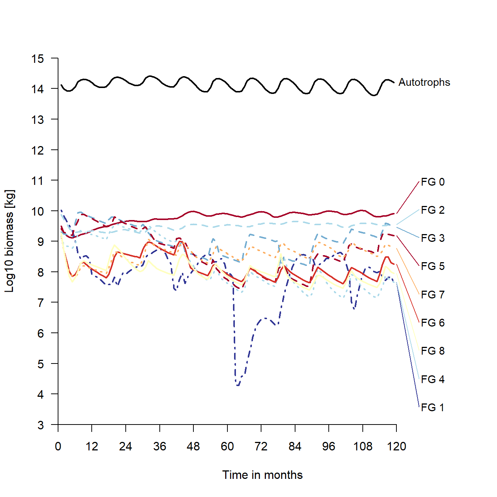
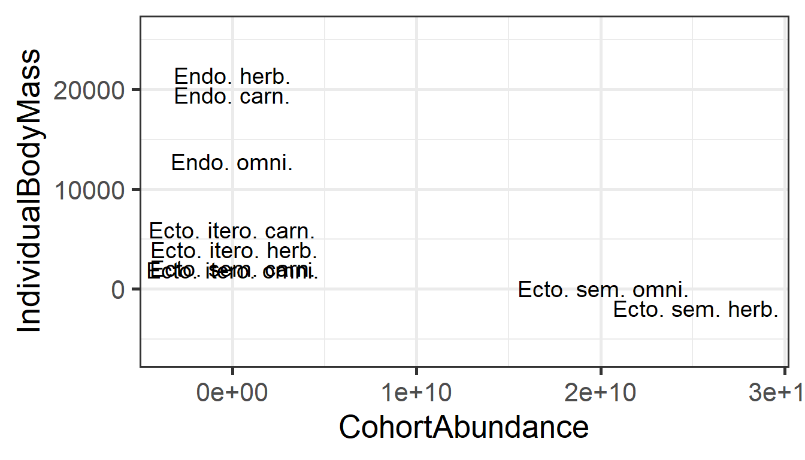
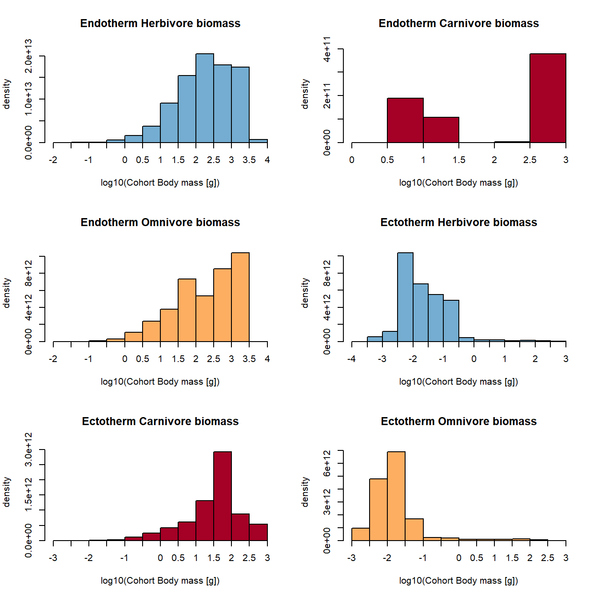
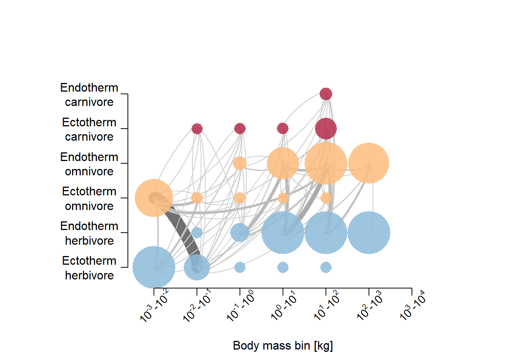
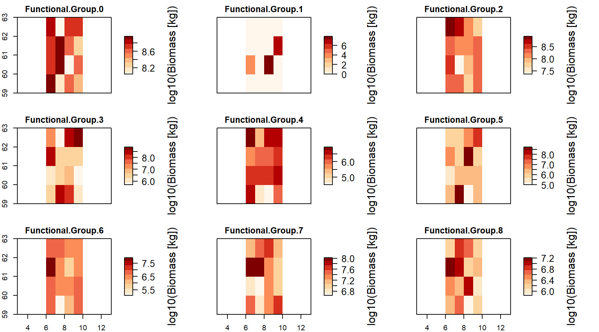

# Norway case 1

This is just a first look at what the model predicts for Norway with default settings.


```r
library(MadingleyR)
library(ggplot2)
library(ggpubr)
library(raster)
```

```
## Loading required package: sp
```

```
## 
## Attaching package: 'raster'
```

```
## The following object is masked from 'package:ggpubr':
## 
##     rotate
```

```r
library(ggstance)
```

```
## Warning: package 'ggstance' was built under R version 4.1.2
```

```
## 
## Attaching package: 'ggstance'
```

```
## The following objects are masked from 'package:ggplot2':
## 
##     geom_errorbarh, GeomErrorbarh
```

```r
knitr::opts_chunk$set(comment='%')
load("data/initOut_demo.RData")

sptl_inp = madingley_inputs("spatial inputs")
```

```
## Loading required package: rgdal
```

```
## Warning: package 'rgdal' was built under R version 4.1.2
```

```
## Please note that rgdal will be retired by the end of 2023,
## plan transition to sf/stars/terra functions using GDAL and PROJ
## at your earliest convenience.
## 
## rgdal: version: 1.5-27, (SVN revision 1148)
## Geospatial Data Abstraction Library extensions to R successfully loaded
## Loaded GDAL runtime: GDAL 3.2.1, released 2020/12/29
## Path to GDAL shared files: C:/Users/anders.kolstad/Documents/R/R-4.1.1/library/rgdal/gdal
## GDAL binary built with GEOS: TRUE 
## Loaded PROJ runtime: Rel. 7.2.1, January 1st, 2021, [PJ_VERSION: 721]
## Path to PROJ shared files: C:/Users/anders.kolstad/Documents/R/R-4.1.1/library/rgdal/proj
## PROJ CDN enabled: FALSE
## Linking to sp version:1.4-6
## To mute warnings of possible GDAL/OSR exportToProj4() degradation,
## use options("rgdal_show_exportToProj4_warnings"="none") before loading sp or rgdal.
## Overwritten PROJ_LIB was C:/Users/anders.kolstad/Documents/R/R-4.1.1/library/rgdal/proj
```

```
## Reading default input rasters from:  C:/Users/anders.kolstad/Documents/R/R-4.1.1/library/MadingleyR/spatial_input_rasters.............
```

```r
chrt_def = madingley_inputs("cohort definition")
stck_def = madingley_inputs("stock definition")
mdl_prms = madingley_inputs("model parameters") # useful later for running the model
```

Setting the spatial window to cover Norway


```r
spatial_window = c(5, 31, 58, 71)
```

Plot the spatial window to check selection

```r
plot_spatialwindow(spatial_window)
```


Because the spatial window needs to be square (I think), it is difficult to get Norway nicely fitting inside. I will start with a more narrow scope, just looking at southern-central Norway


```r
spatial_window = c(5, 12, 58, 65)
plot_spatialwindow(spatial_window)
```


The default resolution is 1 degree, giving (7 x 7 =) 49 cells in this case, which is too much. The resolution is defined by the spatial input rasters, but 1 degree resolution is the maximum. Finer resolutio is possible. I will therefore focus on just Central Norway. Plotting on top of mean annual temperature.


```r
mat = mean(sptl_inp[[10]])
```


```r
spatial_window = c(6, 10, 59, 63)
plot_spatialwindow(spatial_window, 
                   ylim=c(55,65), xlim=c(-10,20),
                   input_raster = mat)
```



Notice how at high latitudes, one degree north-south is much longer in distance compared to 1 degree east-west.


```r
mdata <-  madingley_init(spatial_window = spatial_window,
                       cohort_def = chrt_def,
                       stock_def = stck_def,
                       spatial_inputs = sptl_inp,
                       max_cohort = 100)
```

```
% Processing: realm_classification, land_mask, hanpp, available_water_capacity
% Processing: Ecto_max, Endo_C_max, Endo_H_max, Endo_O_max
% Processing: terrestrial_net_primary_productivity_1-12
% Processing: near-surface_temperature_1-12
% Processing: precipitation_1-12
% Processing: ground_frost_frequency_1-12
% Processing: diurnal_temperature_range_1-12
% 
```

## Spin-up


```r
mdata2 <-  madingley_run(
  out_dir = "temp",
  madingley_data = mdata, 
  years = 10, 
  cohort_def = chrt_def, 
  stock_def = stck_def, 
  spatial_inputs = sptl_inp, 
  model_parameters = mdl_prms,
  max_cohort = 100,
  silenced = TRUE)
```

```
% Warning in system(run_exec, intern = T): running command '"C:/Users/
% anders.kolstad/Documents/R/R-4.1.1/library/MadingleyR/win_exec/madingley.bat"'
% had status 5
```

```r
# Runtime approx 15 sec
```


```r
plot_timelines(mdata2)
```

```
% Warning in xtfrm.data.frame(x): cannot xtfrm data frames

% Warning in xtfrm.data.frame(x): cannot xtfrm data frames
```



The 10 year spin up was probably way too short, and we can see much variation, even a collaps-like event for one group. The pattern for the autotrophs is just the seasonal variation.


Exploring the cohorts in mdata2. Looking only at herbivorous endotherms, we can look at the relationship between individual size and abundance

```r
temp <- mdata2$cohorts
temp <- temp[temp$FunctionalGroupIndex==0,]

ggplot(data = temp)+
  geom_point(aes(x = log(IndividualBodyMass), 
                 y =  log(CohortAbundance)
                 ),
             alpha=.1, 
             size=8, 
             colour="blue",
             pch=16)+
  theme_bw(base_size = 20)
```



```r
# plotting all grid cells and all cohorts or FG 0
```

No relationship.


Lets look at biomass differences between functional groups. First,let make more intuitive names for the functional groups.


```r
link <- data.frame(
  FG = seq(0,8,1),
  FGname = c("Endo. herb.",
             "Endo. carn.",
             "Endo. omni.",
             "Ecto. sem. herb.", # semelparous (insect etc)
             "Ecto. sem. carn.",
             "Ecto. sem. omni.",
             "Ecto. itero. herb.", # iteroparous (reptiles etc)
             "Ecto. itero. carn.",
             "Ecto. itero. omni."
             )
)
```


```r
temp <- mdata2$cohorts

temp2 <- aggregate(data = temp,
                   IndividualBodyMass~factor(FunctionalGroupIndex),
                   FUN = mean)
temp2$CohortAbundance <- aggregate(data = temp,
                   CohortAbundance~factor(FunctionalGroupIndex),
                   FUN = mean)[,2]

names(temp2)[1]<- "FG"

temp2$FG <- as.character(temp2$FG)
temp2$FGname <- link$FGname[match(temp2$FG, link$FG)]


ggplot(temp2, aes(x = CohortAbundance,
                 y = IndividualBodyMass,
                 label = FGname))+
  geom_text(size = 5, position =  position_dodge2v(2000))+
  theme_bw(base_size = 20)+
  scale_y_continuous(expand = expansion(mult=c(.2,.2)))+
  scale_x_continuous(expand = expansion(mult=c(.2,.2)))
```



Obs, beware of strong dodging in thsi figure in place to be able to read all labels. 

Endothermic carnivores and herbivores are the biggest animals, but they make up a low proportion of the total biomass. Omnivorous ectotheric and semelparous species (insects) make up the bulk biomass.

Note: The individual body mass is here the mean of all cohorts. If reproduction is low, mean individual body mass increases because of a higher propotion of older individuals (higher biomass in the cohors containing older individuals).


```r
plot_densities(mdata2)
```

```
% loading inputs from: temp/madingley_outs_16_12_21_15_34_12/
```



I'm not good at reading these figures yet.


```r
plot_trophicpyramid(mdata2)
```

```
% loading inputs from: temp/madingley_outs_16_12_21_15_34_12/
```


Hmm, omnivores have a big biomass but only feed on herbivores, not plants.

Create log10-binned food-web plot

```r
plot_foodweb(mdata2, max_flows = 5)
```

```
% loading inputs from: temp/madingley_outs_16_12_21_15_34_12/
```


The interactions are dominated by carnivorous insects eating omnivorous insects. Omnivorous insects must have a high turn over, because their combined biomass is low at any one time.

Plot the spatial biomass

```r
plot_spatialbiomass(mdata2, functional_filter = TRUE)
```

```
% loading inputs from: temp/madingley_outs_16_12_21_15_34_12/
```


The next step I think is to go though the model parameters in mdl_prms and see if the settings make sense for boreal, mainly forested or alpine, ecosystem. We can also change values in the spatial input sptl_inp, for example setting the max biomass for ectotherms (we don't have large reptiles here).
