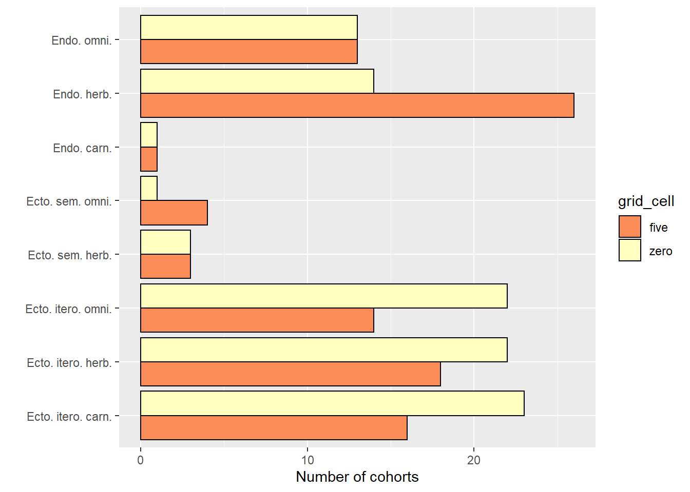
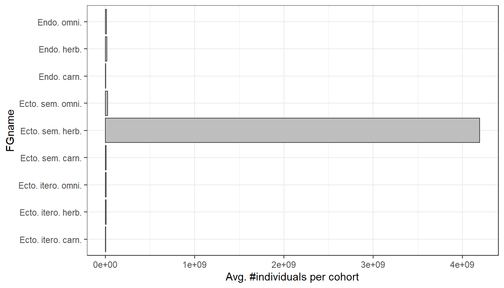
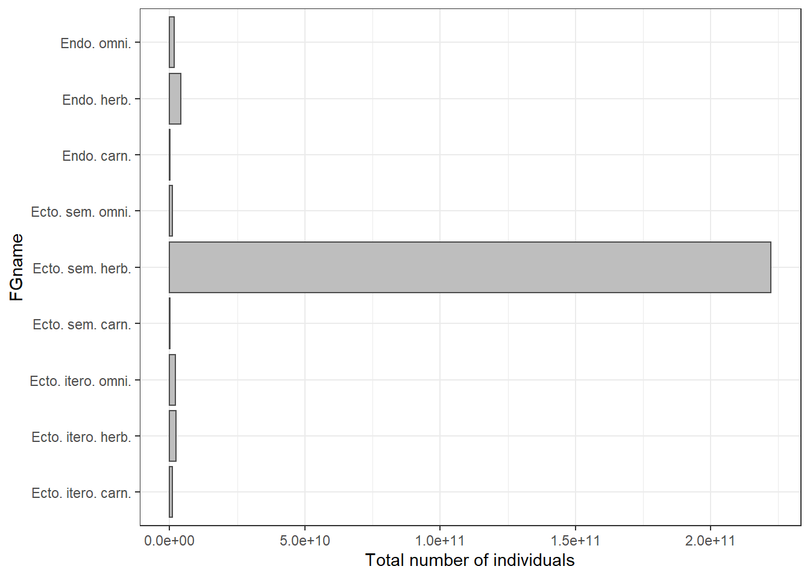

# Norway - default settings

This is just a first look at what the model predicts for Norway with default settings.

This page was last updated ``2021-12-21 16:02:22``


First we try with 4 x 4 grid cells (16 grid cells, with dispersion) in south-central Norway. Then we try with just one grid cell, but a longer temporal scope.

## 16 grid cells

Lets start with a too big bonding box for illustration.

```r
spatial_window = c(5, 12, 58, 65)
plot_spatialwindow(spatial_window)
```


The default resolution is 1 degree, giving (7 x 7 =) 49 cells in this case, which is too much for testing purpuses due to compuatation time. The resolution is defined by the spatial input rasters, but 1 degree resolution is the maximum. Finer resolution is possible, ut not courser. I will therefore focus on just Central Norway. Plotting on top of mean annual temperature.


```r
mat = mean(sptl_inp[[10]])
```


```r
spatial_window = c(6, 10, 59, 63)
plot_spatialwindow(spatial_window, 
                   ylim=c(55,65), xlim=c(-10,20),
                   input_raster = mat)
```


Notice how at high latitudes, one degree north-south is much longer in distance compared to 1 degree east-west.


```r
mdata <-  madingley_init(spatial_window = spatial_window,
                       cohort_def = chrt_def,
                       stock_def = stck_def,
                       spatial_inputs = sptl_inp,
                       max_cohort = 100)
```

```
% Processing: realm_classification, land_mask, hanpp, available_water_capacity
% Processing: Ecto_max, Endo_C_max, Endo_H_max, Endo_O_max
% Processing: terrestrial_net_primary_productivity_1-12
% Processing: near-surface_temperature_1-12
% Processing: precipitation_1-12
% Processing: ground_frost_frequency_1-12
% Processing: diurnal_temperature_range_1-12
% 
```


```r
mdata2 <-  madingley_run(
  out_dir = "temp",
  madingley_data = mdata, 
  years = 10, 
  cohort_def = chrt_def, 
  stock_def = stck_def, 
  spatial_inputs = sptl_inp, 
  model_parameters = mdl_prms,
  max_cohort = 100,
  silenced = TRUE)
```

```
% Warning in system(run_exec, intern = T): running command '"C:/Users/
% anders.kolstad/Documents/R/R-4.1.1/library/MadingleyR/win_exec/madingley.bat"'
% had status 5
```

```r
# Runtime approx 15 sec
```


```r
plot_timelines(mdata2)
```

```
% Warning in xtfrm.data.frame(x): cannot xtfrm data frames

% Warning in xtfrm.data.frame(x): cannot xtfrm data frames
```


The 10 year spin up was probably way too short, and we can see much variation or instability, but none the less, the seasonal patterns is visible for both autotrophs and heterotrophs, but it it much to little. There should be almost no ectotherm biomass in winter. Bird migration I don't think is accounted for either. I predict this will be the biggest challenge - getting the Madingley model to capture the seasonal phenological stages. 


Exploring the cohorts in mdata2. Looking only at herbivorous endotherms, we can look at the relationship between individual size and abundance

```r
temp <- mdata2$cohorts
temp <- temp[temp$FunctionalGroupIndex==0,]

ggplot(data = temp)+
  geom_point(aes(x = log(IndividualBodyMass), 
                 y =  log(CohortAbundance)
                 ),
             alpha=.1, 
             size=8, 
             colour="blue",
             pch=16)+
  theme_bw(base_size = 20)
```


```r
# plotting all grid cells and all cohorts or FG 0
```

No relationship.


Lets look at biomass differences between functional groups. First,let make more intuitive names for the functional groups.


```r
link <- data.frame(
  FG = seq(0,8,1),
  FGname = c("Endo. herb.",
             "Endo. carn.",
             "Endo. omni.",
             "Ecto. sem. herb.", # semelparous (insect etc)
             "Ecto. sem. carn.",
             "Ecto. sem. omni.",
             "Ecto. itero. herb.", # iteroparous (reptiles etc)
             "Ecto. itero. carn.",
             "Ecto. itero. omni."
             )
)
```


```r
temp <- mdata2$cohorts

temp2 <- aggregate(data = temp,
                   IndividualBodyMass~factor(FunctionalGroupIndex),
                   FUN = mean)
temp2$CohortAbundance <- aggregate(data = temp,
                   CohortAbundance~factor(FunctionalGroupIndex),
                   FUN = mean)[,2]

names(temp2)[1]<- "FG"

temp2$FG <- as.character(temp2$FG)
temp2$FGname <- link$FGname[match(temp2$FG, link$FG)]


ggplot(temp2, aes(x = CohortAbundance,
                 y = IndividualBodyMass,
                 label = FGname))+
  geom_text(size = 5, position =  position_dodge2v(2000))+
  theme_bw(base_size = 20)+
  scale_y_continuous(expand = expansion(mult=c(.2,.2)))+
  scale_x_continuous(expand = expansion(mult=c(.2,.2)))
```


Obs, beware of strong dodging in this figure in place to be able to read all labels. 

Endothermic carnivores and herbivores are the biggest animals. Omnivorous ectotheric and semelparous species (insects) are small but numerous. The total biomass for a trophic group must somehow be the product of these two axes (se biomass pyramid below).

Note: The individual body mass is here the mean of all cohorts. If reproduction is low, mean individual body mass increases because of a higher proportion of older individuals (higher biomass in the cohorst containing older individuals).


```r
plot_densities(mdata2)
```

```
% loading inputs from: temp/madingley_outs_21_12_21_10_29_15/
```


This figure is showing the distribution of total cohort biomass for each FG. For Herbivores (top right), the distribution is left-skewed, telling us that there is a threshold for how big a cohort cen get. This can be due to reproductive limitations og perhaps intraspecific competition leading to starvation or dispersal. Ectotherm biomass has a clear optimum, but no limitation in size, probably due to high plasticity in reproductive rates.  


```r
plot_trophicpyramid(mdata2)
```

```
% loading inputs from: temp/madingley_outs_21_12_21_10_29_15/
```


Hmm, omnivores have a big biomass but only feed on herbivores, not plants.
Autrophic biomass is one quadrillion, or 100 trillion, og 10 000 billion kg. That's 100 billion tons. These numbers are way to high. According to Wikipedia, 100 billion tons C is about 1/5th of the world biomass. Perhaps the unit in this figure should be g and not kg. The spatial inputs are given in grams, so it would make sense if these were also in grams. But even then the number is too big.

The autrophic biomass in this figure is summed, accumulated for the whole year. Let me recreate the number in the figure. 

Rewrite autrophic biomass in a different way

```r
10^15.17
```

```
% [1] 1.479108e+15
```
This is the same as 1.47 * 10^15

```r
1.47 * 10^15
```

```
% [1] 1.47e+15
```

and the same as

```r
paste0("10^", round(
  log10(1.479108e+15), 2))
```

```
% [1] "10^15.17"
```


Now if we sum the biomass for the whole last year:

```r
(biom <- sum(mdata2$time_line_stocks$TotalStockBiomass[
  mdata2$time_line_stocks$Year==max(mdata2$time_line_stocks$Year) ]))
```

```
% [1] 1.443508e+15
```

```r
#Converted to base10 scientific
paste0("10^", round(
  log10(biom), 2))
```

```
% [1] "10^15.16"
```
That's it. But that's weird, as the same 'biomass' is counted again and again each month.


This is what the code looks like, (slightly modified) in plot_trophicpyramid()

```r
years <-  0
tl <-  mdata2$time_line_stocks
tl <-  aggregate(tl, by = list(tl$Year), FUN = sum)
tl <-  tl[(nrow(tl) - length(years) + 1):nrow(tl), ]
(biom <- mean(tl$TotalStockBiomass))
```


Create log10-binned food-web plot

```r
plot_foodweb(mdata2, max_flows = 5)
```

```
% loading inputs from: temp/madingley_outs_21_12_21_10_29_15/
```



The interactions are dominated by carnivorous insects eating omnivorous insects. Omnivorous insects must have a high turn over, because their combined biomass is low at any one time.

Plot the spatial biomass

```r
plot_spatialbiomass(mdata2, functional_filter = TRUE)
```

```
% loading inputs from: temp/madingley_outs_21_12_21_10_29_15/
```



The next step I think is to go though the model parameters in mdl_prms and see if the settings make sense for boreal, mainly forested or alpine, ecosystem. We can also change values in the spatial input sptl_inp, for example setting the max biomass for ectotherms (we don't have large reptiles here).


## Single grid cell
Using a single grid cell we can run the simulation for longer, and see how that affects things.


```r
spatial_window = c(9, 10, 60, 61)
plot_spatialwindow(spatial_window, 
                   ylim=c(55,65), xlim=c(-10,20),
                   input_raster = mat)
```




```r
mdata <-  madingley_init(spatial_window = spatial_window,
                       cohort_def = chrt_def,
                       stock_def = stck_def,
                       spatial_inputs = sptl_inp,
                       max_cohort = 100)
```

```
% Processing: realm_classification, land_mask, hanpp, available_water_capacity
% Processing: Ecto_max, Endo_C_max, Endo_H_max, Endo_O_max
% Processing: terrestrial_net_primary_productivity_1-12
% Processing: near-surface_temperature_1-12
% Processing: precipitation_1-12
% Processing: ground_frost_frequency_1-12
% Processing: diurnal_temperature_range_1-12
% 
```
Using 100 years instead of 10

```r
mdata2 <-  madingley_run(
  out_dir = "temp",
  madingley_data = mdata, 
  years = 100, 
  cohort_def = chrt_def, 
  stock_def = stck_def, 
  spatial_inputs = sptl_inp, 
  model_parameters = mdl_prms,
  max_cohort = 100,
  silenced = TRUE)
```

```
% Warning in system(run_exec, intern = T): running command '"C:/Users/
% anders.kolstad/Documents/R/R-4.1.1/library/MadingleyR/win_exec/madingley.bat"'
% had status 5
```

```r
# Runtime approx 45 sec
```


```r
plot_timelines(mdata2)
```

```
% Warning in xtfrm.data.frame(x): cannot xtfrm data frames

% Warning in xtfrm.data.frame(x): cannot xtfrm data frames
```


The components seem to stabilise relatively fast, and after ~20 years there are no long-term trends (results vary between each time this page is rendered). The relative biomass distribution between functional groups is different. This is probably a characteristic of this grid cell, and have less to do with the number of years simulated by the model. 


