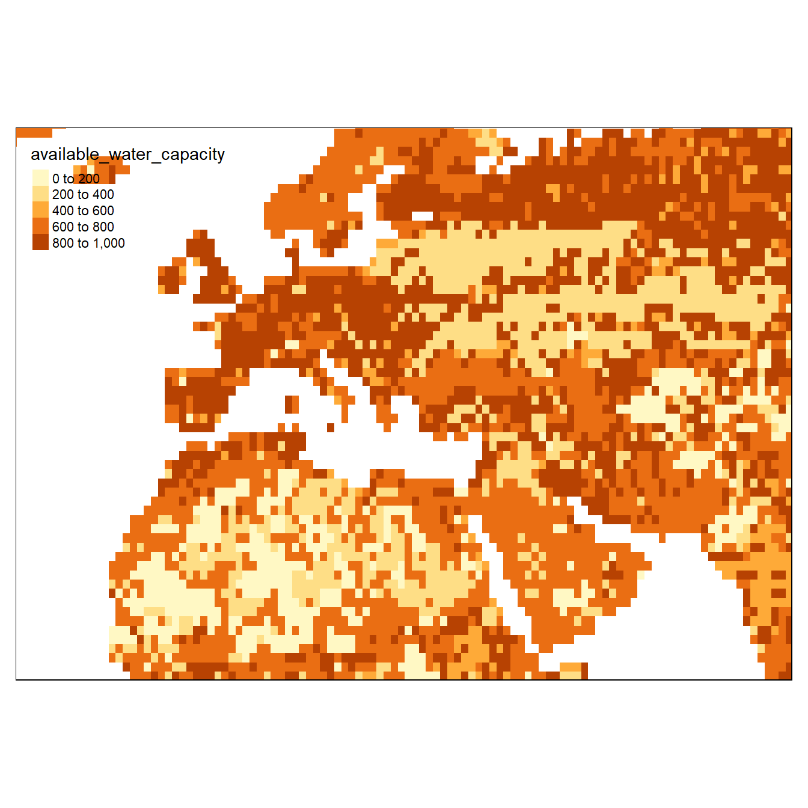
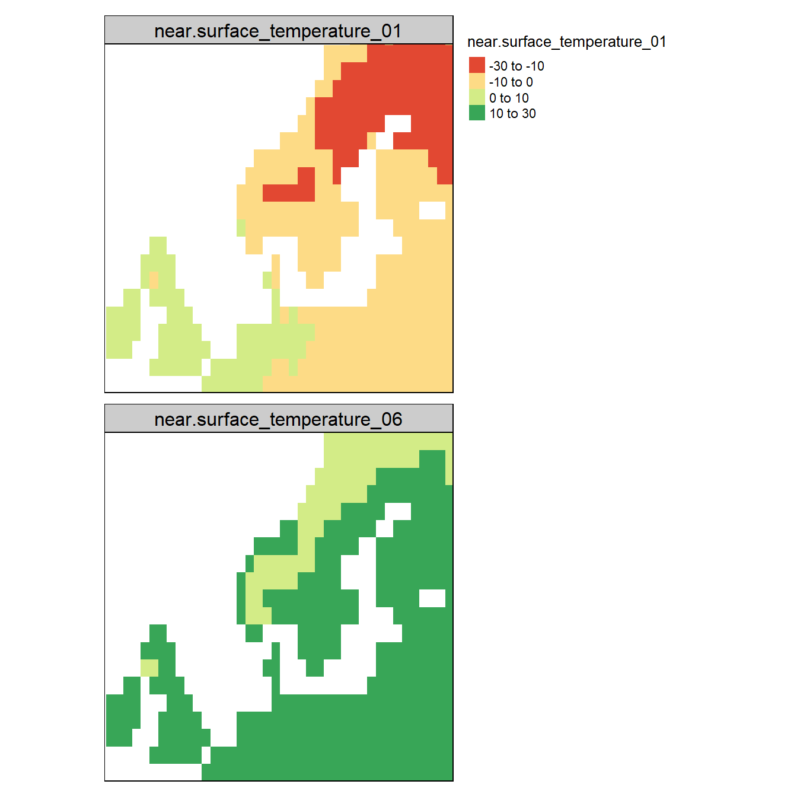
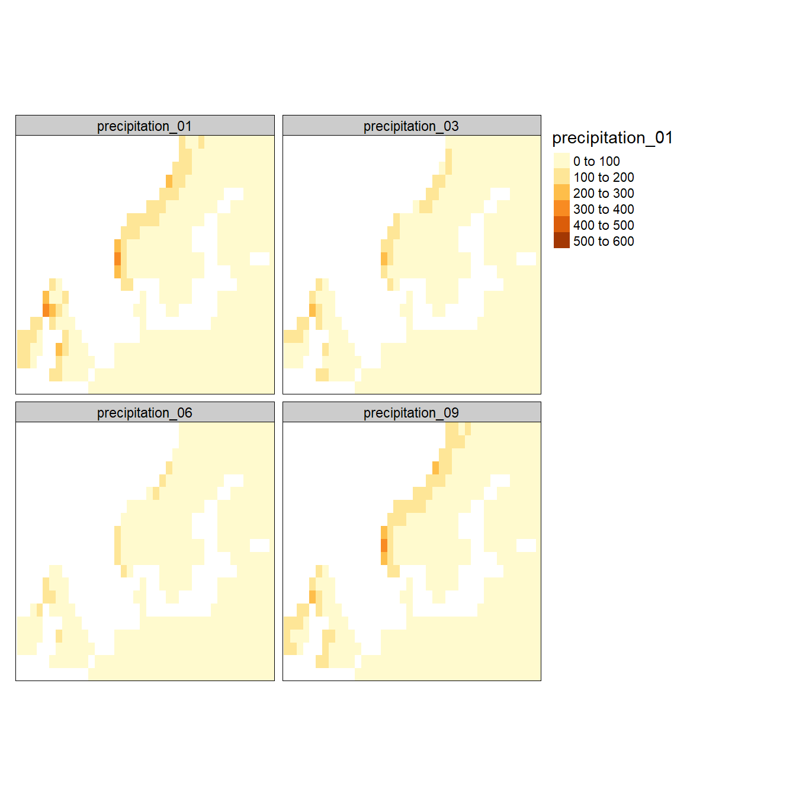
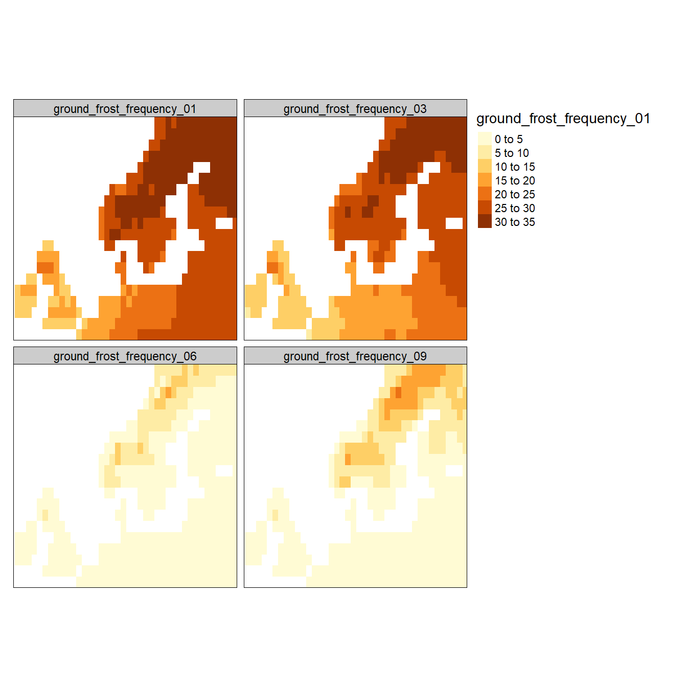
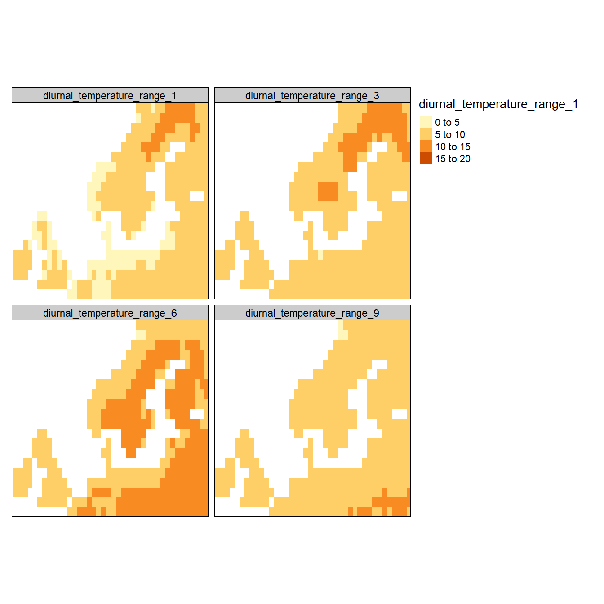
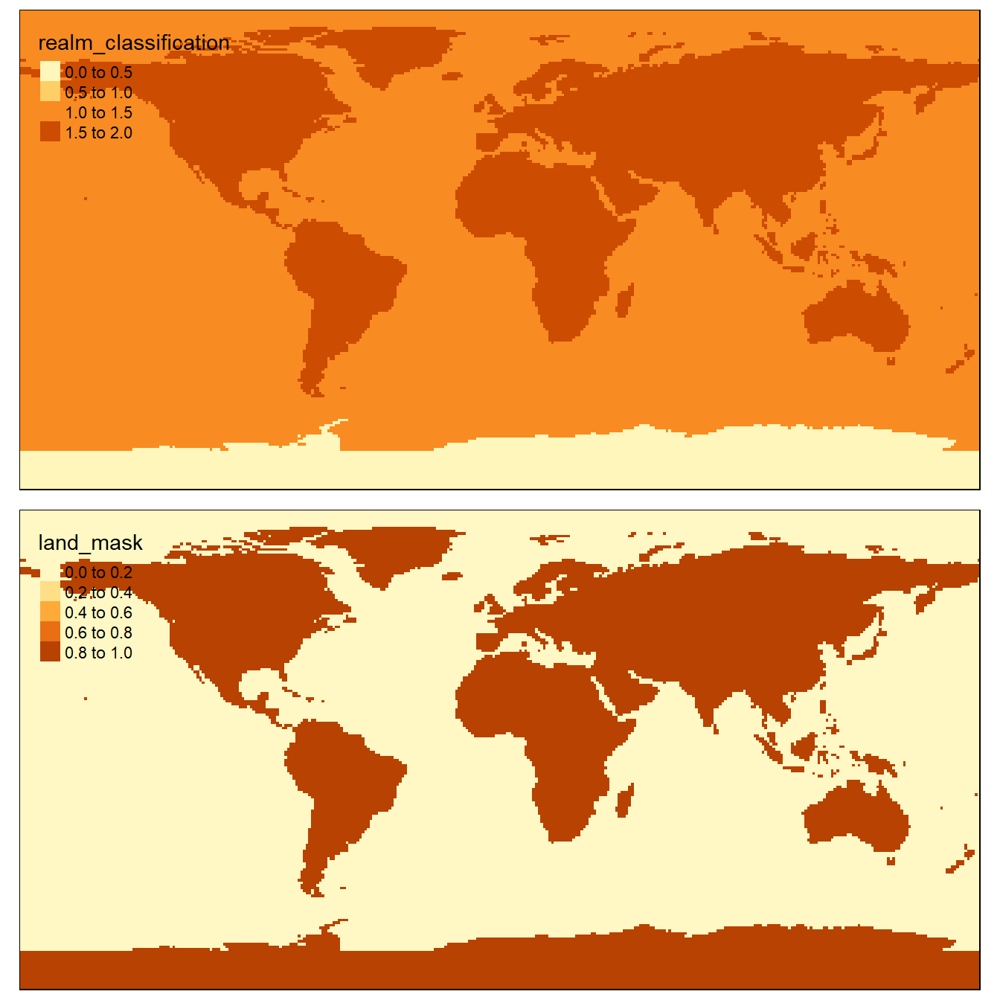
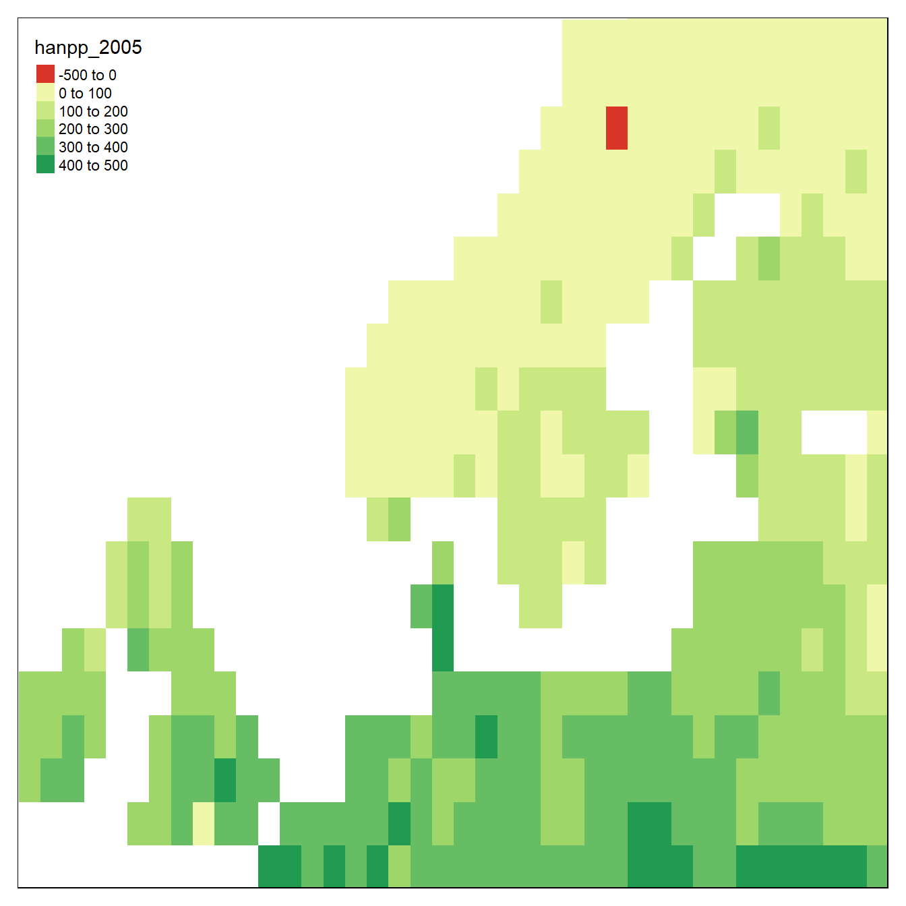
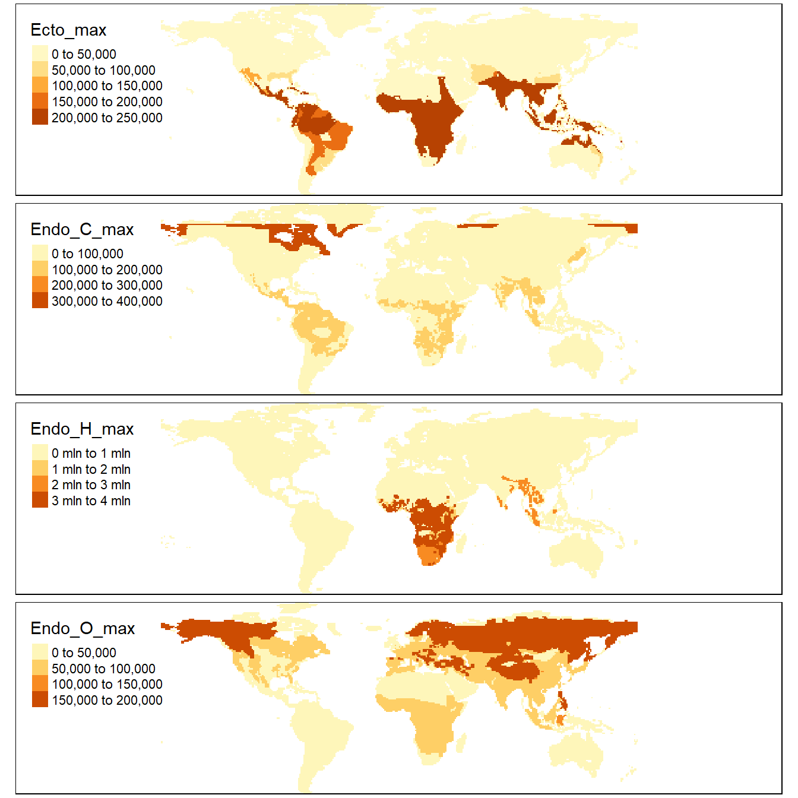
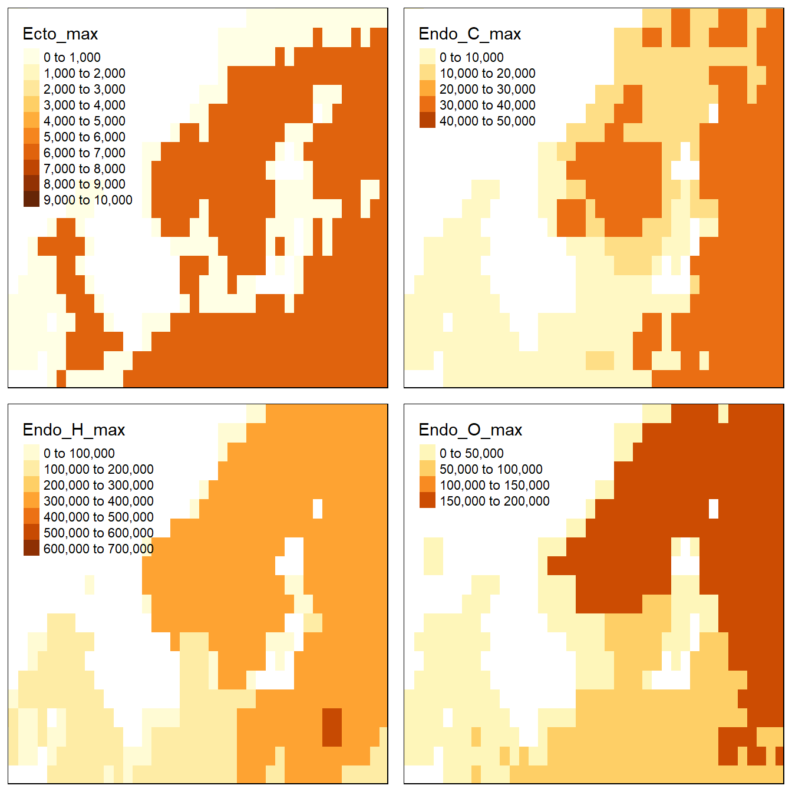
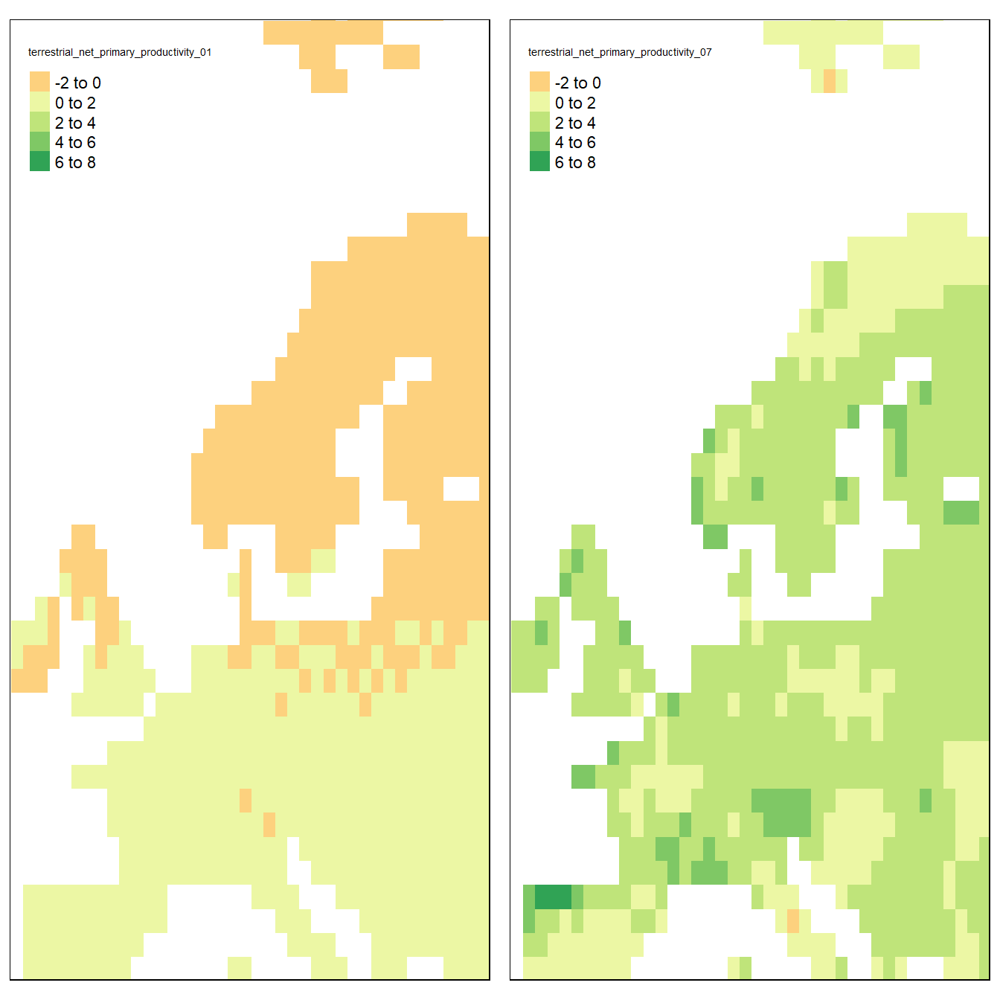

# Exploring spatial inputs


This page was last updated ``2021-12-20 13:22:30``


On this page I am exploring the spatial inputs to see if they make sense fir Norway.


## Climate data

There are five climate data inputs:

```r
cat(names(sptl_inp[c(4,10,11,12,13)]), sep="\n")
```

```
% available_water_capacity
% near-surface_temperature
% precipitation
% ground_frost_frequency
% diurnal_temperature_range
```
They are on a monthly resolution. I'm not sure about what time period the default rasters represents, but these layers can easily be changes, or modified, to either simulate climate change or to model ecosystem structure under a different past climate to use as a reference point in say ecological condition assessments. 

Lets explore the seasonal variation in some of these datasets.


<h3> Available water capacity </h3>


```r
temp <- sptl_inp$available_water_capacity

box <- bb( xlim = c(-10,30),
  ylim = c(50,70))
tm_shape(temp, bbox = box)+
  tm_raster()    #seq(-30,30,10))
```


```r
rm(temp)
```

This looks a bit un-nuanced. Ket's first see this pattern in a continental context. Note: there's only one band here (annual means). 


```r
temp <- sptl_inp$available_water_capacity

box2 <- bb( xlim = c(-30,80),
  ylim = c(10,70))
tm_shape(temp, bbox = box2)+
  tm_raster()    #seq(-30,30,10))
```



```r
rm(temp)
```

The majo, expected patterns are visible, but Norway non-the-less have values that are comparateble to parts of Sahara. WHat does this environmental varieble actually represent? 


<h3> Temperature </h3>


```r
temp <- sptl_inp$`near-surface_temperature`

#box <- bb( xlim = c(-10,20),
#  ylim = c(55,65))

tm_shape(temp[[c(1,6)]], bbox = box)+
  tm_raster(style = "fixed", breaks = c(-30,-10,0,10, 30))    #seq(-30,30,10))
```



```r
rm(temp)
```

Minusgrader i Januar (øverst) og varmegrader i juni (nederst).

<h3> Precipitation </h3>


```r
temp <- sptl_inp$precipitation

#box <- bb( xlim = c(-10,20),
#  ylim = c(55,65))

tm_shape(temp[[c(1,3,6, 9)]], bbox = box)+
  tm_raster(style = "fixed", breaks = seq(0,600,100))
```



```r
rm(temp)
```

The W-E gradiant is evident in the precipitatin data. 

<h3> Ground frost frequency </h3>

This is probably the number of ground frost days per month.

```r
temp <- sptl_inp$ground_frost_frequency

tm_shape(temp[[c(1,3,6, 9)]], bbox = box)+
  tm_raster()
```



```r
rm(temp)
```

<h3> Diurnal temperature range </h3>


```r
temp <- sptl_inp$diurnal_temperature_range

tm_shape(temp[[c(1,3,6, 9)]], bbox = box)+
  tm_raster(style = "fixed", breaks = seq(0,20,5))
```



```r
rm(temp)
```

This must be the difference between day and nighttime temperatures. There is a coast-inlanbd gradient with oceanic climates being lass variable on a diurnal scale. 

<h3> WorldClim </h3>

I could get some more high resolution data from WorldClim for 
- temperature tmean or BIO1
- precipitation BIO12 (also pmean?)
- mean diurnal range BIO2

Using 10 arcdegrees resolution (1/6 of a degree) and only the tile that covers the bulk of southern Norway


```r
Norbioclim<-getData('worldclim',var='tmean',res=10) 
```

The above chunk failed unfortunately. See: https://github.com/rspatial/raster/issues/191


## Other spatial inputs


```r
cat(names(sptl_inp[-c(4,10,11,12,13)]), sep="\n")
```

```
% realm_classification
% land_mask
% hanpp
% Ecto_max
% Endo_C_max
% Endo_H_max
% Endo_O_max
% terrestrial_net_primary_productivity
```

Realm classifivation and the land mask are basically the same. They're just a masks seperating terrestrial land from the marine environment. Realm classifications has three levels (sea, land, antarctica, whereas land_mask treats Antarctica as land. Only terrestrial ecosystems are supported in the R version of Madingley. The C++ version also include marine ecosystems.


```r
tmap_arrange(
tm_shape(sptl_inp$realm_classification)+#, bbox = box)+
  tm_raster(),    #seq(-30,30,10))
tm_shape(sptl_inp$land_mask)+#, bbox = box)+
  tm_raster())
```



<h3> HANPP </h3>
Single band.


```r
tm_shape(sptl_inp$hanpp, bbox = box)+
  tm_raster(style = "fixed", breaks = c(-500,0,100,200,300,400,500))
```



The human land use is very limited in Norway according to this data. It's probably true. More detailed data could perhaps be found and used, such as AR5, but I'm not going into that now.


<h3> Max and min individual biomass </h3>


```r
tmap_arrange(
tm_shape(sptl_inp$Ecto_max)+#, bbox = box)+
  tm_raster(),    #seq(-30,30,10))
tm_shape(sptl_inp$Endo_C_max)+#, bbox = box)+
  tm_raster(),
tm_shape(sptl_inp$Endo_H_max)+#, bbox = box)+
  tm_raster(),    #seq(-30,30,10))
tm_shape(sptl_inp$Endo_O_max)+#, bbox = box)+
  tm_raster())
```



Ectothermic species are allowed (by the model) to get much bigger around the tropics (top). These are probably reptiles.

Endothermic Carnivores are allowed to get the biggest in the north.

Pure Herbivores are allowed to get biggest in Africa (savannahs). The units seem to be in minutes for some reason. The max allowed size for herbivores is 

```r
maxValue(sptl_inp$Endo_H_max)/1000000
```

```
% [1] 3.940034
```
tons.

Omnivores are allowed to get biggest further north than the pure herbivores. They can only grow to 190 kg.

```r
maxValue(sptl_inp$Endo_O_max)/1000
```

```
% [1] 190.7923
```


```r
tmap_arrange(
tm_shape(sptl_inp$Ecto_max, bbox = box)+
  tm_raster(style = "fixed", breaks = seq(0,10000,1000)), 
tm_shape(sptl_inp$Endo_C_max, bbox = box)+
  tm_raster(style = "fixed", breaks = seq(0,50000,10000)),
tm_shape(sptl_inp$Endo_H_max, bbox = box)+
  tm_raster(style = "fixed", breaks = seq(0,700000,100000)),    
tm_shape(sptl_inp$Endo_O_max, bbox = box)+
  tm_raster())
```



In Norway, ectotherms can get to about 6 kg. The biggest species are probably snakes.
Carnivores can grow to 40 kg. About right for a wolf. Bears are omnivores. They can grow to 200 kg in Norway. Pure herbivores are allowed to grow to about 500 kg.

The data make sense, also for Norway.


<h3> NPP </h3>


```r
tmap_arrange(
tm_shape(sptl_inp$terrestrial_net_primary_productivity[[1]], bbox = box)+
  tm_raster()
,
tm_shape(sptl_inp$terrestrial_net_primary_productivity[[7]], bbox = box)+
  tm_raster()
)
```



NPP for January to the left and july to the right. NPP is zero in winter, which is good. 


