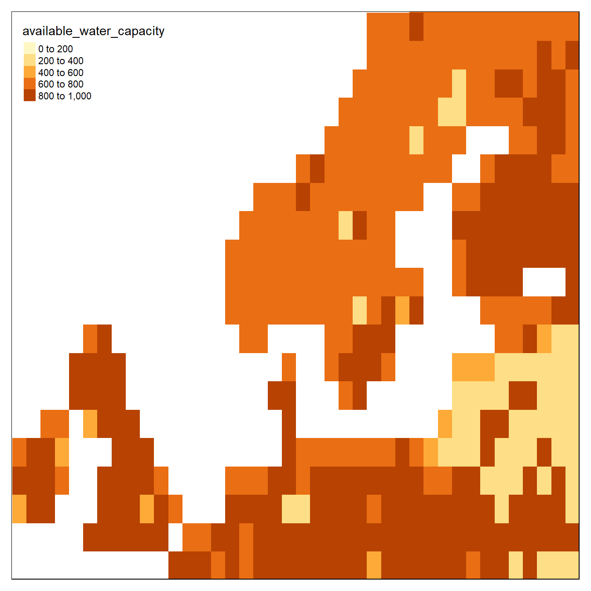

# Tuning Madingley to Norwegian conditions


This page was last updated ``2021-12-17 15:57:16``


<h2> Climate data </h2>

There are five climate data inputs:

```r
cat(names(sptl_inp[c(4,10,11,12,13)]), sep="\n")
```

```
% available_water_capacity
% near-surface_temperature
% precipitation
% ground_frost_frequency
% diurnal_temperature_range
```
They are on a monthly resolution. I'm not sure about what time period the default rasters represents, but these layers can easily be changes, or modified, to either simulate climate change or to model ecosystem structure under a different past climate to use as a referanse point in say ecological condition assesments. 

Lets explore the seasonal variation in some of these datasets

```r
temp <- sptl_inp$`near-surface_temperature`

box <- bb( xlim = c(-10,20),
  ylim = c(55,65))

tm_shape(temp[[c(1,6)]], bbox = box)+
  tm_raster(style = "fixed", breaks = c(-30,-10,0,10, 30))    #seq(-30,30,10))
```



```r
rm(temp)
```

Minusgrader i Januar (øverst) og varmegrader i juni (nederst).
