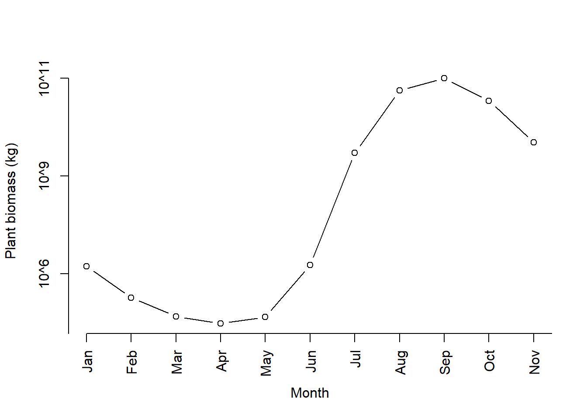
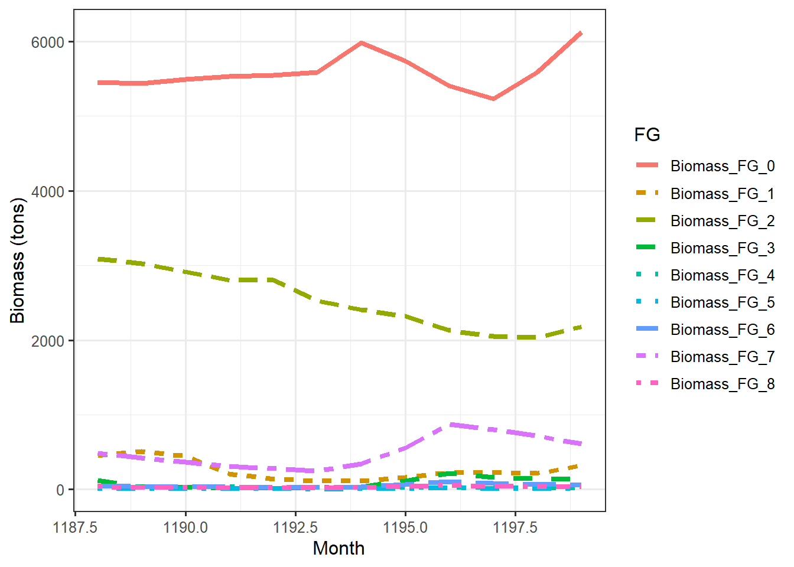

# Trophic pyramids

Exploring the biomass time series produced from running a 100 year spinup for 16 grid cells in central Norway.

This page was last updated ``2022-08-10 14:57:28``


```r
plot_trophicpyramid(mdata2)
```

```
% loading inputs from: temp/madingley_outs_09_08_22_13_49_03/
```


These are monthly means (se below). The 

plant:animal ratio is 

```r
(10^8.9+10^9.41+10^9.76)/10^11.16
```

```
% [1] 0.06308892
```
or about 6%.

Plant biomass converted to gigatons: 

```r
10^11.16/10^12
```

```
% [1] 0.144544
```

... or tons

```r
(plants <- 10^11.16/10^3)
```

```
% [1] 144543977
```

Plant biomass presented as biomass densities (tons/km):

```r
gridProps <- read.csv(list_output_paths(mdata2)$grid_properties[1])
# calculate area of simulation, exclude marine grid cells
AreaKm2 <- sum(gridProps$GetCellArea[gridProps$IsMarine==0])
plants/AreaKm2
```

```
% [1] 1498.688
```

These values can perhaps be validated using landskog etc...?


## Fixing a bug inthe R package

The autotrophic or plant biomass was initially 10^15.17 kg, or Written in a more familiar different way, that is the same as


```r
(10^15.17)/10^12 # divided by 1 000 to go from kg to tons, and 1 000 000 000 to get Gt
```

```
% [1] 1479.108
```
Gigatons (Gt). But after the authors fixed the model [following our input](https://github.com/MadingleyR/MadingleyR/issues/1), this estimate was reduced to 10^11.16 kg, or 0.14 gigatons.

Where did/does this number come from?  
I used to be able to recreate the number (that is, before they updated the package) by summing the biomass for the whole last year of the simulation:

```r
biom <- sum(mdata2$time_line_stocks$TotalStockBiomass[
  mdata2$time_line_stocks$Year==max(mdata2$time_line_stocks$Year) ])

#Converted to base10 scientific
paste0("10^", round(
  log10(biom), 2))
# result =  "10^15.17"
```

In the updated version, the biomass estimate used in the trophic pyramid is the annual mean instead:

```r
biom <- mean(mdata2$time_line_stocks$TotalStockBiomass[
  mdata2$time_line_stocks$Year==max(mdata2$time_line_stocks$Year) ])

#Converted to base10 scientific
paste0("10^", round(
  log10(biom), 2))
# result =  "10^15.17"
```

According to [Wikipedia](https://en.wikipedia.org/wiki/Biomass_(ecology)) the total biomass of the world is about 1 000 billion tons (assuming 50% C). This is the same as 1 000 gigatons Gt. A [different source](https://www.weforum.org/agenda/2021/08/total-biomass-weight-species-earth) says 500 Gt for the total world biomass.

Our estimate for the plant biomass of south Norway was therefore about 50% bigger than the total biomass of the planet! 

[Hoeks et al 2020 Glo. Eco. Bio.](https://onlinelibrary.wiley.com/doi/full/10.1111/geb.13354) got comparable values to us when using the same R package and same study extent (4x4 degrees). If our numbers are wrong in this example, then their numbers must be wrong as well.

[Harfoot et al 2014](https://journals.plos.org/plosbiology/article?id=10.1371/journal.pbio.1001841) got much lower values using the C# version of Madingley. For a single grid cell (aseasonal ecosystem in tropical Uganda) they got 24 611 tons of plant biomass. If we multiply that with 16 to become comparable to our study extent, and convert it to Gt, we get 


```
% [1] 0.000393776
```
This is much, much lower than our first estimate.
_J. Hoeks ponited out that Harfoot had reported biomass densities, (kg/km), and shoed how that goes a long way to explaining the differences shoed here_

This is roughly the script that produces the trophic pyramid figure above (plot_trophicpyramid())

```r
years <-  0
tl <-  mdata2$time_line_stocks
tl <-  aggregate(tl, by = list(tl$Year), FUN = mean) # FUN used to be sum before they changed it
tl <-  tl[(nrow(tl) - length(years) + 1):nrow(tl), ]
tl$TotalStockBiomass/10^12
```
I suspect that the unit in `mdata2$time_line_stocks` is grams, and not kg. ( _this was later confirmed by Hoeks_.) As we will see below, it's grams for the heterotrophic cohorts. But even so, the numbers are way off.
 
How do our monthly estimates compare to Harfoot et al 2014.
This is our maximum monthly estimate in the last year of the spin up, converted to Gt:

```r
(temp <- max(
  mdata2$time_line_stocks$TotalStockBiomass[
   mdata2$time_line_stocks$Year==max(mdata2$time_line_stocks$Year) ])/10^12)
```

```
% [1] 0.238697
```
Our first estimate (before the package update) was 214, which was way to high.
Is we'd then assumed the the unit should've been g and not kg, we'd still get 0.2 Gt (compare with 0.0004 in Harfoot et l 2014).

There must have been  more to this than the g and kg mistake and the fact that the biomass is an accumulated monthly sum. _turns out it was the fact that the unit was desnty not toal biomass_

But why does the R function use an accumulated monthly sum? I can not think of a good reason. _it was a mistake by the developers_

It makes more sense to me to just get the standing biomass for a given month, perhaps the maximum monthly value. In our area in Norway the plant biomass peaks in September.



What about the herbivore data. How are those biomass estimates that are reported in the trophic pyramid above calculated?
In the trophic pyramid we see a value of about 0.006 Gt:

```r
10^9.76/10^12
```

```
% [1] 0.005754399
```

Here is the heterotrophic biomass over the last year of our simulation


```r
dat <- mdata2$time_line_cohorts

#subset to only the last year
#the last year only has 11 month for some reason:
#table(dat$Year)
#looking at the plot_pyramid() function, they still used the last 12 months
dat <- dat[dat$Month > max(dat$Month)-12,] 

# melt data
datm <- data.table::melt(data.table::setDT(dat),
                         id.vars = c("Year", "Month"),
                         variable.name = "FG",
                         value.name = "biomass")

# assuming the unit is g, so i divide by 10^6 to give tons
datm$tons <- datm$biomass/10^6  

ggplot(dat = datm, aes(x = Month, y = tons, 
                       colour = FG,
                       linetype=FG))+
  geom_line(size=1.5)+
  theme_bw(base_size = 12)+
  ylab("Biomass (tons)")
```



Now, let me try to recreate the number in the trophic pyramid.
Combining the herbivores

```r
datherb <- datm[datm$FG == "Biomass_FG_0" |
                  datm$FG == "Biomass_FG_3" |
                  datm$FG == "Biomass_FG_6" ,]
```

Summed biomass across all months in the raw/unknown units. I checked, and the unit is kg, therefore to get Gt:

```r
sum(datherb$biomass)/10^12
```

```
% [1] 0.0687903
```

Again, checking the plot_pyramid() function, they then too this value and divided på 12 to get mean monthly biomass

```r
log10(sum(datherb$biomass)/12)
```

```
% [1] 9.758346
```

The aniaml biomass is therefore comparable to the plants - both show monthly means.


