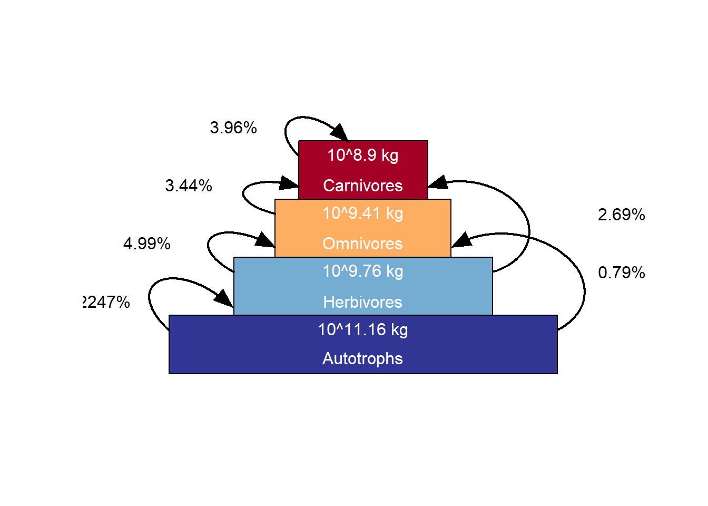

# Trophic pyramids

Exploring the biomass time series produced from running a 10 year spinup for 16 grid cells in central Norway.

This page was last updated ``2021-12-22 10:03:02``


```r
plot_trophicpyramid(mdata2)
```

```
% loading inputs from: temp/madingley_outs_22_12_21_08_31_24/
```



Hmm, omnivores have a big biomass but only feed on herbivores, not plants.

Autotrophic biomass is one quadrillion, or 100 trillion, og 10 000 billion kg. That's 100 billion tons. These numbers are way to high. According to Wikipedia, 100 billion tons C is about 1/5th of the world biomass. Perhaps the unit in this figure should be g and not kg. The spatial inputs are given in grams, so it would make sense if these were also in grams. But even then the number is too big, even after converting biomass to C.

Hoeks et al 2020 Glo. Eco. Bio. got comparable values to us when using the same R package and same study extent (4x4 degrees). Harfoot et al 2014 got much lower values. For a single grid cell (aseasonal ecosystem in tropical Uganda) they got 24 611 tons og plant biomass. If we multiply that with 16 to become comparable to our study extent, we get 3.93776\times 10^{5} tons, which is 2.6622525\times 10^{-7} times smaller than what we got. 

However, how do our monthly estimates compare to Harfoot et al 2014.

```r
# our max monthly estimate in the last year of the spin up, converted to tons:
(temp <- max(
  mdata2$time_line_stocks$TotalStockBiomass[
   mdata2$time_line_stocks$Year==max(mdata2$time_line_stocks$Year) ])/1000)
```

```
% [1] 2.14235e+11
```

```r
#harfoots estimate 
harfoot <- 24611*16

temp/harfoot
```

```
% [1] 544053
```
Our values are about halv a million times bigger.
If the values are actually in g's and not kg:

```r
temp <- temp/1000
temp/harfoot
```

```
% [1] 544.053
```
we're still far off. 


The autrophic biomass in this figure is summed, accumulated for the whole of the last year. This is what the code looks like, (slightly modified) in plot_trophicpyramid()

```r
years <-  0
tl <-  mdata2$time_line_stocks
tl <-  aggregate(tl, by = list(tl$Year), FUN = sum)
tl <-  tl[(nrow(tl) - length(years) + 1):nrow(tl), ]
(biom <- mean(tl$TotalStockBiomass))
```

Let me recreate the number in the figure. 
Rewrite autrophic biomass in a different way

```r
10^15.17
```

```
% [1] 1.479108e+15
```
This is the same as 1.47 * 10^15

```r
1.47 * 10^15
```

```
% [1] 1.47e+15
```

and the same as

```r
paste0("10^", round(
  log10(1.479108e+15), 2))
```

```
% [1] "10^15.17"
```


Now if we sum the biomass for the whole last year:

```r
(biom <- sum(mdata2$time_line_stocks$TotalStockBiomass[
  mdata2$time_line_stocks$Year==max(mdata2$time_line_stocks$Year) ]))
```

```
% [1] 1.48435e+15
```

```r
#Converted to base10 scientific
paste0("10^", round(
  log10(biom), 2))
```

```
% [1] "10^15.17"
```
That's it. But that's weird, as the same 'biomass' is counted again and again each month.

It makes more sense to me to just get the standing biomass for a given month. However, plant biomass peaks not in mid summer, but later.

```r
biom <- mdata2$time_line_stocks$TotalStockBiomass[
  mdata2$time_line_stocks$Year==max(mdata2$time_line_stocks$Year) ]

myY <- seq(0,max(biom), length.out = 5)
myY2 <- round(seq(0,log10(max(biom)), length.out = 5), 0)
myY2 <- paste0("10^", myY2)


plot(biom, type="b", axes=F, ylab="Plant biomass (kg)", xlab="Month")
axis(1, 1:12, month.abb, las=2)
axis(2, myY, myY2)
```


It may be more appropriate to use the max for the last year, or the mean of the max over the last n-years.
How do the monthly values compare to Harfoot et al 2014?


What about the herbivore data.


```r
dat <- mdata2$time_line_cohorts
#subset to only the last year
dat <- dat[dat$Year == max(dat$Year),]
# melt
datm <- data.table::melt(dat,
                         id.vars = c("Year", "Month"),
                         variable.name = "FG",
                         value.name = "biomass")
```

```
% Warning in data.table::melt(dat, id.vars = c("Year", "Month"), variable.name
% = "FG", : The melt generic in data.table has been passed a data.frame and will
% attempt to redirect to the relevant reshape2 method; please note that reshape2
% is deprecated, and this redirection is now deprecated as well. To continue using
% melt methods from reshape2 while both libraries are attached, e.g. melt.list,
% you can prepend the namespace like reshape2::melt(dat). In the next version,
% this warning will become an error.
```

```r
datm$tons <- datm$biomass/1000000
ggplot(dat = datm, aes(x = Month, y = tons, 
                       colour = FG,
                       linetype=FG))+
  geom_line(size=1.5)+
  theme_bw(base_size = 12)+
  ylab("Biomass (tons)")
```


Combining the herbivores

```r
datherb <- datm[datm$FG == "Biomass_FG_0" |
                  datm$FG == "Biomass_FG_3" |
                  datm$FG == "Biomass_FG_6" ,]
```

Summed biomass across all months

```r
sum(datherb$tons)
```

```
% [1] 83650.28
```

Summed for the last month only

```r
sum(datherb$tons[datherb$Month==max(datherb$Month)])
```

```
% [1] 8374.995
```


Hoeks et al 2020 give the numbers for total herbivore biomass

```r
hoeks <- 10^11.11
#convert to tonnage
hoeks <- hoeks/1000
```
 This is a big number, even though the ecosystems are also different. 
 
Harfoot et al 2014 get this number fo total herbivore biomass in tons (converted to same spatial extent)

```r
240*16
```

```
% [1] 3840
```

This is lower than all our numbers, but comparable to our max monthly estimate.


