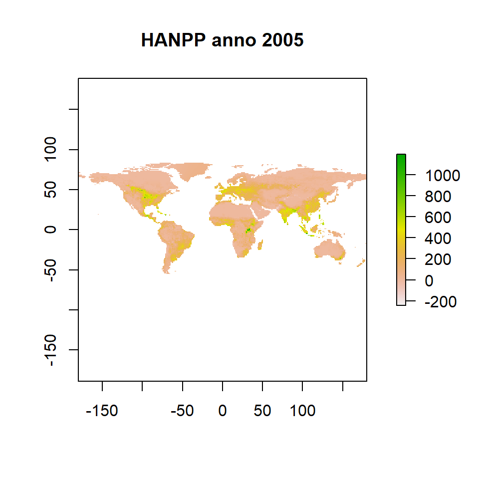

--- 
title: "Running the Madingley Model with Norwegian data"
author: "Anders L. Kolstad"
date: "2021-12-22"
site: "bookdown::bookdown_site"
output:
  bookdown::gitbook: default
documentclass: book
link-citations: yes
---

# Introduction

This work is part of the MadFates project, run by Joachim Töpper. The goal is to learn bit about the Madingley model and its potential for modeling biomass distributions across trophic levels in Norwegian boreal ecosystem. Perhaps limited to forests.

This page is hosted in GitHub and produced using bookdown.

## Some useful links

Paper on the [R package](https://onlinelibrary.wiley.com/doi/full/10.1111/geb.13354)

Paper on the [model itself](https://journals.plos.org/plosbiology/article?id=10.1371/journal.pbio.1001841)

### Examples of use

[Removing carnivores](https://onlinelibrary.wiley.com/doi/10.1111/ecog.05191)

[Land-use change](https://www.nature.com/articles/s41598-020-70960-9)


## Terms and definitions

- Cohorts - Organisms with similar functional roles are grouped into cohorts which are treated as sinle entities in the model to reduce computational requirements.

- Stock - autotrofic biomass is treated as a single entity (stock).

- Model initialisation - After loading input data the model is run once without a year parameter. Not sure why exactly, or what the output is. 

- Spin-up phase - The model needs to run for 100-1000 simulated years without any user modifications to allow the ecosystem componets to reach a stable state. 

- HANPP - human appropriation of net primary productivity. The variable spans from zero (or actually with some points <0 which I don't understand how to interpret) and 1200. I'm not sure what the units are, but probably they are the same as for the autrophic biomass. In [case study 2](https://github.com/MadingleyR/MadingleyR/blob/master/CaseStudies/CASESTUDY2.md) they simply set the value to a uniform value between zero and one in this way:

```r
sptl_inp$hanpp[] = fractional_veg_production[i]
```

and set 'apply_hanpp =1' which reduces NPP in fractions provided in the hanpp spatial input raster.
The example HANPP input data is from year 2005.


```r
library(MadingleyR)
library(raster)
sptl_inp = madingley_inputs("spatial inputs")
```

```
## Warning: package 'rgdal' was built under R version 4.1.2
```

```
## Reading default input rasters from:  C:/Users/anders.kolstad/Documents/R/R-4.1.1/library/MadingleyR/spatial_input_rasters.............
```

```r
raster::plot(sptl_inp$hanpp, main = "HANPP anno 2005")
```




